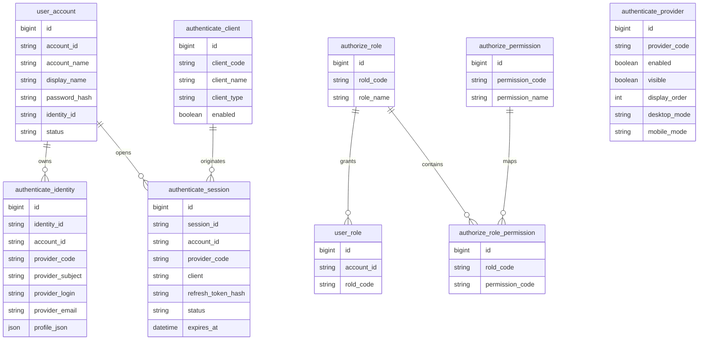

# 统一身份管理设计

创建日期：2026-04-19
最后更新：2026-04-24

本文档统一描述 IterLife 当前统一身份层的定位、能力边界、核心模型，以及登录页的目标交互设计。

适用范围：`iterlife-reunion`、`iterlife-reunion-ui`、`iterlife-expenses`、`iterlife-expenses-ui`、`iterlife-idaas`、`iterlife-idaas-ui`

## 1. 当前定位

`iterlife-idaas` / `iterlife-idaas-ui` 是 IterLife 的统一身份层，负责承载账号、认证（含第三方登录认证及会话）、权限（功能权限及数据权限）管理等。

## 2. 目标边界

### `iterlife-idaas`

负责：
- 账号管理
- 统一认证（含账号管理、本地及第三方认证、会话管理等）
- access token / refresh token 签发与刷新
- 账户主档与身份绑定
- 角色与权限基础模型

### `iterlife-idaas-ui`

负责：

- 登录页
- 第三方登录回调页
- 会话管理页
- 跨应用跳转承接页

### `iterlife-reunion` / `iterlife-expenses`

作为业务应用，只负责：

- 业务 API
- 验证来自 `iterlife-idaas` 的 token
- 基于账号标识和权限做业务授权

## 3. 当前能力边界

当前认证方式：

- 账号密码
- GitHub
- Google
- 微信 PC 扫码

当前隐藏但已具备实现基础的认证方式：

- 微信 PC 扫码

本轮设计目标支持的认证方式：

- 账号密码
- Google
- GitHub
- X
- Apple
- Microsoft
- Facebook（实现，但是隐藏入口）
- 微信扫码
- 支付宝扫码

当前会话能力：

- access token / refresh token
- 当前账号信息查询
- 会话列表
- 会话登出（一次登出，全局失效）

当前前端能力：

- 登录入口
- OAuth 回调承接
- 会话中心
- 统一登出与跨应用跳转

本轮设计目标前端能力：

- 更简洁的单页登录入口
- 图标化第三方登录入口
- 微信扫码弹层承接
- 桌面与移动端统一的轻量登录视觉
- 基于配置的登录方式显隐

## 4. 登录页设计基线

### 4.1 设计目标

- 参考附件中的轻量登录卡片，整体从“控制台页面”收敛为“单一登录动作页面”。
- 保留统一身份层的完整能力，但首屏只突出“登录”这一件事。
- 页面必须对真实能力保持诚实，不展示尚未落地的注册链接、忘记密码流程或不可用的第三方按钮。
- 优先兼容移动端视觉，同时保持桌面端居中窄栏体验。

### 4.2 页面结构

- 页面主体改为单列居中卡片，宽度收敛到适合移动端截图比例的窄卡。
- 卡片顶部保留可选返回入口：
  - 当存在 `redirect_uri` 或明确来自业务系统时，显示返回箭头。
  - 独立访问 IDaaS 时，不强制显示返回箭头。
- 标题使用 `壹零贰肆老友记`。
- 副标题不再默认展示“Create an account”。
- 当前 IterLife 没有开放自助注册时，副标题改为更真实的说明文案，例如“Use your IterLife account to continue.”
  - 当未来确实开放自助注册后，再切换为注册入口文案。
- 除网站官方名称 `壹零贰肆老友记` 外，默认所有用户可见文案使用英文，除非有明确的中文呈现要求。
- 表单区只保留两个输入项：
  - `Account`
  - `Password`
- 表单下方只在真实能力存在时展示辅助入口：
  - 若已上线找回密码，则展示 `Forgot password?`
  - 若未上线，则不展示死链接
- 主按钮为整行圆角按钮，文案统一为 `Login`。
- 主按钮下方使用一条分割线和 `or`，把密码登录与第三方登录明确分层。
- 第三方登录区采用图标化入口，不再使用当前的大块 provider card。
- 卡片底部保留简短的条款说明和隐私政策链接。

### 4.3 第三方登录区布局

- 登录方式使用圆形图标按钮，风格参考附件中的轻量社交图标行。
- 为兼顾简洁和完整支持，首选两行布局：
  - 第一行：Google、GitHub、Apple、微信扫码
  - 第二行：Microsoft、X、Facebook、支付宝扫码
- 若配置中未启用某一 provider，则该 provider 不占位、不显示 disabled 按钮。
- 当实际启用的 provider 不超过 4 个时，第三方登录区自动收敛为单行。
- 图标区标题建议改为简短版本，例如：
  - `Continue with`
  - 或 `Use another sign-in method`

### 4.4 各登录方式的交互约束

- 账号密码：
  - 仍然作为首屏默认路径
  - 输入框使用内嵌图标和弱边框，弱化后台系统感
- GitHub / Google / Apple / Microsoft / X / Facebook：
  - 统一采用点击图标后发起 OAuth 跳转
  - callback 仍由 `iterlife-idaas-ui` 承接，但仅作为无停留中转页使用
  - provider 不可用时，按钮不展示，而不是展示后报错
- 支付宝扫码：
  - 作为国内主流扫码登录方式，与微信扫码并列
  - 桌面端点击后优先打开支付宝二维码弹层，由用户使用支付宝 App 扫码
  - 移动端若在支付宝内打开，可切到支付宝内授权路径
  - 移动端若不在支付宝内，默认不展示二维码弹层，避免无效扫码交互
- 微信扫码：
  - 当前微信扫码能力已经实现，但登录页默认继续隐藏，直到本轮简化登录页一并正式开放。
  - 设计上不建议直接等同为普通 OAuth 跳转按钮
  - 桌面端点击后应优先打开二维码弹层，由用户使用微信扫码
  - 移动端若在微信内打开，可切到微信内授权路径
  - 移动端若不在微信内，默认不展示二维码弹层，避免“自己扫自己”的无效交互

### 4.5 视觉基线

- 背景从当前偏“深色控制台”风格，收敛为更轻的浅底或柔和浅灰底，突出登录卡片本身。
- 卡片使用白色或近白色表面，圆角更大，阴影更轻，接近移动端原生登录面板。
- 输入框改为浅底、浅边框和内嵌图标，不再使用当前厚重的深色输入框。
- 主按钮改为纯黑或高对比深色填充，保持视觉上只有一个主动作。
- 第三方登录按钮统一为圆形边框图标，不再混用文字按钮和卡片按钮。
- 页面上方品牌信息缩小，避免与登录动作竞争。

### 4.6 文案与真实性要求

- 当前不展示“Create an account”，除非自助注册真实可用。
- 当前不展示“Forgot password?”，除非密码找回真实可用。
- provider 标题、成功态、失败态文案统一简化，避免后台错误细节直接暴露在登录主页面。
- 登录页面只描述当前真实支持的能力，不透出未接入 provider 的占位文案。

### 4.7 配置与显隐原则

- 登录页面必须以“后端 provider 可用性 + 前端 feature flag”双重结果决定是否展示某个第三方入口。
- 推荐前端按 provider 维护独立开关：
  - `enableGithubLogin`
  - `enableGoogleLogin`
  - `enableAppleLogin`
  - `enableMicrosoftLogin`
  - `enableXLogin`
  - `enableFacebookLogin`
  - `enableAlipayLogin`
  - `enableWeixinLogin`
- 最终展示顺序固定，不因显隐变化改变主次逻辑，只在缺项时自动收缩布局。

### 4.8 登录方式配置来源

- 每种登录方式是否“可用”与是否“在页面显示”，都必须由数据库配置决定，而不是只靠前端写死或环境变量写死。
- 对应的数据库结构与初始化数据变更，统一通过 `iterlife-stack/docs/sql/*.sql` 人工执行脚本管理，不通过 Flyway 等运行时迁移框架自动执行。
- 当前阶段暂不实现管理界面，直接通过数据库维护配置即可。
- 推荐把 provider 配置拆成两层语义：
  - `enabled`：后端是否允许发起该 provider 的登录流程
  - `visible`：前端登录页是否展示该 provider 的入口
- 登录页是否显示某个 provider，必须同时满足：
  - 数据库配置 `enabled = true`
  - 数据库配置 `visible = true`
  - 对应 provider 的后端配置完整可用
- 即使某个 provider 已实现，如果数据库配置要求隐藏，登录页也不得展示入口。
- 国内扫码类 provider 如微信、支付宝，必须同样遵循数据库配置显隐规则。

### 4.9 响应式规则

- 桌面端：单卡片居中，第三方入口最多两行。
- 平板端：维持单卡片，留白适度增加。
- 手机端：卡片宽度接近屏幕宽度，第三方图标自动换行，主按钮保持整行。
- 微信扫码在手机端默认不走桌面二维码方案。
- 支付宝扫码在手机端默认不走桌面二维码方案。

### 4.10 页脚复用约束

- 登录页页脚必须与 `iterlife-reunion-ui` 当前页脚在结构、文案、链接和样式层面保持完全一致。
- `iterlife-idaas-ui` 不再维护独立变体页脚，不允许继续以 `APP_NAME` 等独立文案生成另一套底部信息。
- 优先复用 `iterlife-reunion-ui` 的既有页脚实现或抽出共享组件，避免未来升级时出现两套页脚漂移。
- 登录页简化只作用于登录卡片与登录区，不单独改写页脚品牌口径。

## 5. 统一模型

### 5.1 主体原则

- 当前阶段 `iterlife-idaas` 暂时不引入“用户”概念，只处理“账号”。
- 每一种成功的登录方式都对应一个账号；账号统一落在 `user_account`。
- `authenticate_*` 表只处理认证事实，不承担权限含义。
- `authorize_*` 表只处理权限事实，不承担认证含义。
- 任何业务关联都不得使用没有业务含义的内部自增 `id`，统一使用显式业务键。

### 5.2 会话原则

- access token 短期有效。
- refresh token 用于续期。
- 会话必须可撤销、可审计、可单端退出和全端退出。
- 当登录后没有客户端回调地址时，Session 页面是默认兜底回跳页。
- Session 页面必须显示该条会话的认证方式，例如 `password`、`google`、`github`、`weixin`。
- Session 页面必须显示该条会话由哪个客户端发起，例如 `iterlife-reunion`、`iterlife-expenses` 或 `iterlife-idaas`。
- 会话默认有效期为 12 小时。
- 当会话剩余有效期不超过 4 小时时，系统可在用户仍活跃的情况下自动滚动续期 12 小时。
- 同一账号新登录成功后，旧的有效会话自动全局失效，只保留最新会话继续使用。

### 5.3 认证与授权分层

- Authentication 解决“当前是哪个账号发起认证”和“当前会话是否有效”。
- Authorization 解决“当前账号可以访问什么资源、执行什么操作”。
- 认证相关物理表统一使用 `authenticate_*` 前缀，配合账户主表 `user_account`。
- 权限相关物理表统一使用 `authorize_*` 前缀。
- `authorize_role_permission` 不再使用内部自增字段做业务关联，统一切到 `rold_code` 与 `permission_code`。

### 5.4 首次登录建档原则

- 每一种登录方式在首次成功认证后，都必须创建对应的 `user_account` 主档。
- 不允许只创建 `authenticate_identity` 而没有账号主档。
- 密码登录、Google、GitHub、微信、支付宝及后续 provider，最终都必须归一到 `user_account`。
- 若后续存在账户绑定，则是在已有 `user_account` 上追加新的 `authenticate_identity`，而不是跳过主档。

## 6. 账号与身份模型

### 6.1 账号主档

- `user_account` 是统一账户主档。
- 业务主键为 `account_id`，表示账号本身，可为字符串形式、邮箱形式或后续手机号形式。
- `account_name` 是账户名，用于展示和人类可读识别。
- `display_name` 是展示名称。
- `identity_id` 记录该账号首次进入系统时对应的身份记录，关联 `authenticate_identity.identity_id`。
- 当前阶段不再在 `user_account` 中保留账号邮箱概念；邮箱属于认证身份侧的 provider 信息，而不是账户主档的一部分。

### 6.2 认证身份

- `authenticate_identity` 是所有认证方式的统一身份表。
- 业务主键为 `identity_id`。
- `account_id` 关联 `user_account.account_id`。
- `provider_code` 记录认证方式，例如 `password`、`google`、`github`、`weixin`、`alipay`。
- `provider_subject` 记录第三方侧稳定主体。
- `provider_login` 记录第三方返回的可读登录名。
- `provider_email` 仅表示该 provider 返回的邮箱资料，不代表账号主档邮箱。
- `profile_json` 保存第三方原始资料快照。

### 6.3 认证会话

- `authenticate_session` 是统一会话表。
- 业务主键为 `session_id`。
- `account_id` 关联 `user_account.account_id`。
- `provider_code` 记录本次会话的认证提供方。
- `client` 记录本次认证是由哪个客户端发起。
- `client_type` 不再保留在会话表中，而统一由 `authenticate_client` 管理。

### 6.4 认证客户端

- `authenticate_client` 是认证客户端注册表。
- 业务主键为 `client_code`。
- `client_name` 记录对外名称。
- `client_type` 记录客户端类型，仅表示 `WEB`、`IOS`、`ANDROID`、`MINI_PROGRAM` 等运行形态。
- 当前首批客户端至少包括：
  - `iterlife-idaas`
  - `iterlife-reunion`
  - `iterlife-expenses`

## 7. 核心数据对象

- `user_account`
- `authenticate_identity`
- `authenticate_session`
- `authenticate_client`
- `authenticate_provider`
- `authorize_role`
- `authorize_permission`
- `user_role`
- `authorize_role_permission`

### 7.1 Provider 配置对象

`authenticate_provider` 至少包含：

- `provider_code`
- `enabled`
- `visible`
- `display_order`
- `desktop_mode`
- `mobile_mode`
- `updated_at`

其中：

- `desktop_mode` 可用于区分 `oauth_redirect` / `qr_popup`
- `mobile_mode` 可用于区分 `oauth_redirect` / `in_app_auth` / `hidden`

### 7.2 数据库脚本交付约束

- 数据库变更脚本统一放在 `../sql/` 下。
- 账户主档与认证表初始重命名基线脚本：`../sql/20260420_01_authenticate_tables.sql`
- 会话认证来源补充脚本：`../sql/20260424_01_authenticate_session_source.sql`
- 账号中心模型、认证客户端与业务键重命名脚本：`../sql/20260424_02_account_centric_auth_model.sql`
- 账号来源、会话提供方与 provider 表重命名脚本：`../sql/20260424_03_provider_identity_alignment.sql`
- 账号来源、身份 provider 字段与授权关联列名收口脚本：`../sql/20260424_04_account_schema_alignment.sql`
- 所有脚本由管理员按 PR 说明手动执行，业务应用运行时不自动改库。

## 8. 完整领域模型 / E-R 图

## 9. 当前接入状态

- `reunion` 已具备统一登录入口、会话中心入口和统一登出接口。
- `expenses` 正在从旧的本地登录字段向统一账户模型收敛。
- 版本、发布与运维基线统一收敛在 `../operations_deployment_baseline.md`。

## 10. 本轮设计结论

- 登录页面和统一身份模型都以“账号”为中心，而不是“用户”为中心。
- 登录页只负责输入登录信息或发起第三方登录；没有回调地址时，Session 页面是兜底结果页。
- Session 页面必须展示认证提供方与发起客户端。
- 第三方登录中转页只负责无停留处理，不向用户渲染停留页面。
- 每种登录方式的启用状态与页面显隐，都由数据库配置控制，当前阶段直接改数据库，不先做管理界面。
- 登录方式顺序也由数据库 `display_order` 决定。
- 所有业务关联不得依赖内部 `id`，统一使用 `account_id`、`identity_id`、`session_id`、`client_code`、`provider_code`、`rold_code`、`permission_code`。
