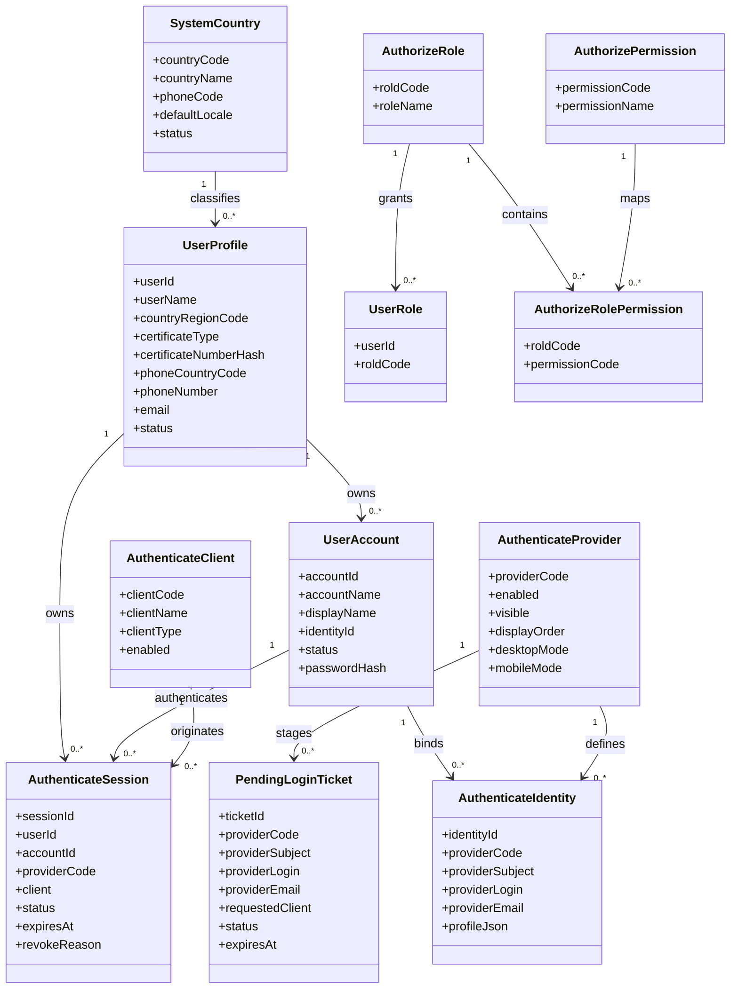

# 统一身份管理设计

创建日期：2026-04-19
最后更新：2026-04-24

本文档统一描述 IterLife 当前统一身份层的定位、能力边界、核心模型，以及登录页的目标交互设计。

适用范围：`iterlife-reunion`、`iterlife-reunion-ui`、`iterlife-expenses`、`iterlife-expenses-ui`、`iterlife-idaas`、`iterlife-idaas-ui`

## 1. 当前定位

`iterlife-idaas` / `iterlife-idaas-ui` 是 IterLife 的统一身份层，负责承载账号、认证（含第三方登录认证及会话）、权限（功能权限及数据权限）管理等。

## 2. 目标边界

### `iterlife-idaas`

负责：
- 账号管理
- 统一认证（含账号管理、本地及第三方认证、会话管理等）
- access token / refresh token 签发与刷新
- 账户主档与身份绑定
- 角色与权限基础模型

### `iterlife-idaas-ui`

负责：

- 登录页
- 第三方登录回调页
- 会话管理页
- 跨应用跳转承接页

### `iterlife-reunion` / `iterlife-expenses`

作为业务应用，只负责：

- 业务 API
- 验证来自 `iterlife-idaas` 的 token
- 基于账号标识和权限做业务授权

## 3. 当前能力边界

当前认证方式：

- 账号密码
- GitHub
- Google
- 微信 PC 扫码

本轮设计目标支持的认证方式：

- 账号密码
- Google
- GitHub
- X
- Apple
- Microsoft
- Facebook（实现，但是隐藏入口）
- 微信扫码
- 支付宝扫码

当前会话能力：

- access token / refresh token
- 当前账号信息查询
- 会话列表
- 会话登出（一次登出，全局失效）

当前前端能力：

- 登录入口
- OAuth 回调承接
- 会话中心
- 统一登出与跨应用跳转

本轮设计目标前端能力：

- 更简洁的单页登录入口
- 图标化第三方登录入口
- 微信扫码弹层承接
- 桌面与移动端统一的轻量登录视觉
- 基于配置的登录方式显隐

## 4. 登录页设计基线

### 4.1 设计目标

- 参考附件中的轻量登录卡片，整体从“控制台页面”收敛为“单一登录动作页面”。
- 保留统一身份层的完整能力，但首屏只突出“登录”这一件事。
- 页面必须对真实能力保持诚实，不展示尚未落地的注册链接、忘记密码流程或不可用的第三方按钮。
- 优先兼容移动端视觉，同时保持桌面端居中窄栏体验。

### 4.2 页面结构

- 页面主体改为单列居中卡片，宽度收敛到适合移动端截图比例的窄卡。
- 卡片顶部保留可选返回入口：
  - 当存在 `redirect_uri` 或明确来自业务系统时，显示返回箭头。
  - 独立访问 IDaaS 时，不强制显示返回箭头。
- 标题使用 `壹零贰肆老友记`。
- 副标题不再默认展示“Create an account”。
- 当前 IterLife 没有开放自助注册时，副标题改为更真实的说明文案，例如“Use your IterLife account to continue.”
  - 当未来确实开放自助注册后，再切换为注册入口文案。
- 除网站官方名称 `壹零贰肆老友记` 外，默认所有用户可见文案使用英文，除非有明确的中文呈现要求。
- 表单区只保留两个输入项：
  - `Account`
  - `Password`
- 表单下方只在真实能力存在时展示辅助入口：
  - 若已上线找回密码，则展示 `Forgot password?`
  - 若未上线，则不展示死链接
- 主按钮为整行圆角按钮，文案统一为 `Login`。
- 主按钮下方使用一条分割线和 `or`，把密码登录与第三方登录明确分层。
- 第三方登录区采用图标化入口，不再使用当前的大块 provider card。
- 卡片底部保留简短的条款说明和隐私政策链接。
- 登录成功后，独立访问 IDaaS 的默认落点不再是登录页，也不再默认停留在 Session 页，而是进入 IDaaS 内部双 Tab 结构：
  - `User Center`
  - `Sessions`
- `User Center` 与 `Sessions` 为并级主 Tab，且 `User Center` 排在 `Sessions` 之前。
- 当没有业务客户端回调地址时，登录成功后默认进入 `User Center`。

### 4.3 第三方登录区布局

- 登录方式使用圆形图标按钮，风格参考附件中的轻量社交图标行。
- 为兼顾简洁和完整支持，首选两行布局：
  - 第一行：Google、GitHub、Apple、微信扫码
  - 第二行：Microsoft、X、Facebook、支付宝扫码
- 若配置中未启用某一 provider，则该 provider 不占位、不显示 disabled 按钮。
- 当实际启用的 provider 不超过 4 个时，第三方登录区自动收敛为单行。
- 图标区标题建议改为简短版本，例如：
  - `Continue with`
  - 或 `Use another sign-in method`

### 4.4 各登录方式的交互约束

- 账号密码：
  - 仍然作为首屏默认路径
  - 输入框使用内嵌图标和弱边框，弱化后台系统感
- GitHub / Google / Apple / Microsoft / X / Facebook：
  - 统一采用点击图标后发起 OAuth 跳转
  - callback 仍由 `iterlife-idaas-ui` 承接，但仅作为无停留中转页使用
  - provider 不可用时，按钮不展示，而不是展示后报错
- 支付宝扫码：
  - 作为国内主流扫码登录方式，与微信扫码并列
  - 桌面端点击后优先打开支付宝二维码弹层，由用户使用支付宝 App 扫码
  - 移动端若在支付宝内打开，可切到支付宝内授权路径
  - 移动端若不在支付宝内，默认不展示二维码弹层，避免无效扫码交互
- 微信扫码：
  - 当前微信扫码能力已经实现，并作为正式桌面端登录入口展示。
  - 设计上不建议直接等同为普通 OAuth 跳转按钮
  - 桌面端点击后应优先打开二维码弹层，由用户使用微信扫码
  - 移动端若在微信内打开，可切到微信内授权路径
  - 移动端若不在微信内，默认不展示二维码弹层，避免“自己扫自己”的无效交互

### 4.5 视觉基线

- 背景从当前偏“深色控制台”风格，收敛为更轻的浅底或柔和浅灰底，突出登录卡片本身。
- 卡片使用白色或近白色表面，圆角更大，阴影更轻，接近移动端原生登录面板。
- 输入框改为浅底、浅边框和内嵌图标，不再使用当前厚重的深色输入框。
- 主按钮改为纯黑或高对比深色填充，保持视觉上只有一个主动作。
- 第三方登录按钮统一为圆形边框图标，不再混用文字按钮和卡片按钮。
- 页面上方品牌信息缩小，避免与登录动作竞争。

### 4.6 文案与真实性要求

- 当前不展示“Create an account”，除非自助注册真实可用。
- 当前不展示“Forgot password?”，除非密码找回真实可用。
- provider 标题、成功态、失败态文案统一简化，避免后台错误细节直接暴露在登录主页面。
- 登录页面只描述当前真实支持的能力，不透出未接入 provider 的占位文案。

### 4.7 配置与显隐原则

- 登录页面必须以“后端 provider 可用性 + 前端 feature flag”双重结果决定是否展示某个第三方入口。
- 推荐前端按 provider 维护独立开关：
  - `enableGithubLogin`
  - `enableGoogleLogin`
  - `enableAppleLogin`
  - `enableMicrosoftLogin`
  - `enableXLogin`
  - `enableFacebookLogin`
  - `enableAlipayLogin`
  - `enableWeixinLogin`
- 最终展示顺序固定，不因显隐变化改变主次逻辑，只在缺项时自动收缩布局。

### 4.8 登录方式配置来源

- 每种登录方式是否“可用”与是否“在页面显示”，都必须由数据库配置决定，而不是只靠前端写死或环境变量写死。
- 对应的数据库结构与初始化数据变更，统一通过 `iterlife-stack/docs/sql/*.sql` 人工执行脚本管理，不通过 Flyway 等运行时迁移框架自动执行。
- 当前阶段暂不实现管理界面，直接通过数据库维护配置即可。
- 推荐把 provider 配置拆成两层语义：
  - `enabled`：后端是否允许发起该 provider 的登录流程
  - `visible`：前端登录页是否展示该 provider 的入口
- 登录页是否显示某个 provider，必须同时满足：
  - 数据库配置 `enabled = true`
  - 数据库配置 `visible = true`
  - 对应 provider 的后端配置完整可用
- 即使某个 provider 已实现，如果数据库配置要求隐藏，登录页也不得展示入口。
- 国内扫码类 provider 如微信、支付宝，必须同样遵循数据库配置显隐规则。

### 4.9 响应式规则

- 桌面端：单卡片居中，第三方入口最多两行。
- 平板端：维持单卡片，留白适度增加。
- 手机端：卡片宽度接近屏幕宽度，第三方图标自动换行，主按钮保持整行。
- 微信扫码在手机端默认不走桌面二维码方案。
- 支付宝扫码在手机端默认不走桌面二维码方案。

### 4.10 页脚复用约束

- 登录页页脚必须与 `iterlife-reunion-ui` 当前页脚在结构、文案、链接和样式层面保持完全一致。
- `iterlife-idaas-ui` 不再维护独立变体页脚，不允许继续以 `APP_NAME` 等独立文案生成另一套底部信息。
- 优先复用 `iterlife-reunion-ui` 的既有页脚实现或抽出共享组件，避免未来升级时出现两套页脚漂移。
- 登录页简化只作用于登录卡片与登录区，不单独改写页脚品牌口径。

## 5. 统一模型

### 5.1 主体原则

- 从本轮开始，`iterlife-idaas` 正式引入“用户”概念。
- 用户（`user_profile`，正式表名）是自然人主体；账号（`user_account`）是该用户可用于登录的一个登录入口。
- 一个用户可以拥有多个账号；一个账号只能归属一个用户。
- 每一种可独立登录的方式最终都必须归一到一个 `user_account`；多个 `user_account` 再统一归属到一个 `user_profile`。
- `authenticate_*` 表只处理认证事实，不承担权限含义。
- `authorize_*` 表只处理权限事实，不承担认证含义。
- 任何业务关联都不得使用没有业务含义的内部自增 `id`，统一使用显式业务键。
- 用户的唯一识别基线不是邮箱、手机号或第三方 subject，而是：
  - 所属国家/地区
  - 证件类型
  - 证件号码
- 出于安全与合规要求，证件号码在存储层不应只保存明文：
  - 需要保存可检索的哈希值用于唯一约束
  - 需要保存受保护的密文或脱敏副本用于展示和审计

### 5.2 会话原则

- access token 短期有效。
- refresh token 用于续期。
- 会话必须可撤销、可审计、可单端退出和全端退出。
- 当登录后没有客户端回调地址时，IDaaS 默认进入 `User Center`，`Sessions` 作为同级辅助页存在。
- Session 页面必须显示该条会话的认证方式，例如 `password`、`google`、`github`、`weixin`。
- Session 页面必须显示该条会话由哪个客户端发起，例如 `iterlife-reunion`、`iterlife-expenses` 或 `iterlife-idaas`。
- 会话默认有效期为 8 小时。
- 当会话剩余有效期不超过 4 小时时，系统可在用户仍活跃的情况下自动滚动续期 8 小时。
- 连续自动续期次数默认不超过 10 次。
- 会话有效期、续期窗口和最大续期次数都应做成可配置参数。
- 同一用户下任意账号再次登录成功后，旧的有效会话自动全局失效，只保留最新会话继续使用。

### 5.3 认证与授权分层

- Authentication 解决“当前是哪个账号发起认证”和“当前会话是否有效”。
- Authorization 解决“当前账号可以访问什么资源、执行什么操作”。
- 认证相关物理表统一使用 `authenticate_*` 前缀，配合账户主表 `user_account`。
- 权限相关物理表统一使用 `authorize_*` 前缀。
- `authorize_role_permission` 不再使用内部自增字段做业务关联，统一切到 `rold_code` 与 `permission_code`。

### 5.4 首次登录建档原则

- 每一种登录方式在首次成功认证后，都必须先归属到一个 `user_profile`，再创建或关联对应的 `user_account`。
- 不允许只创建 `authenticate_identity` 而没有账号主档。
- 不允许只创建 `user_account` 而没有所属 `user_profile`。
- 密码登录、Google、GitHub、微信、支付宝、X 及后续 provider，最终都必须归一到：
  - `user_profile`
  - `user_account`
  - `authenticate_identity`
- 若后续存在账户绑定，则是在已有 `user_profile` 下新增或关联 `user_account`，并为该账号新增对应的 `authenticate_identity`。
- 系统不得仅凭邮箱相同或昵称相同自动把第三方账号并入已有用户；用户归并必须经过显式确认和校验。
- 首次第三方登录在 `authenticate_identity(provider_code, provider_subject)` 不存在时，不得直接创建 `user_account` 或 `authenticate_identity`，而是必须先进入“关联已有用户 / 新建用户”选择流程。
- 只有在用户完成明确选择并提交必要信息后，系统才允许正式创建：
  - `user_profile`
  - `user_account`
  - `authenticate_identity`

## 6. 用户、账号与认证模型

### 6.1 用户主档

- 新增 `user_profile` 作为统一用户主档。
- 业务主键为 `user_id`。
- `user_profile` 是本轮确认后的正式用户主表命名，不使用过于泛化的 `user`。
- 用户是自然人主体，唯一识别基线为：
  - `country_region_code`
  - `certificate_type`
  - `certificate_number_hash`
- `certificate_number_hash` 用于唯一约束和查重。
- `certificate_number_ciphertext` 或同等受保护字段用于受控读取和审计。
- 在第一阶段落地中，历史账号和首次第三方登录可先创建“待补全”用户主档，因此上述证件识别字段允许暂时为空。
- 在第一阶段落地中，历史账号允许先回填“待补全”用户主档；但首次第三方登录不再允许自动创建待补全用户主档，而必须进入显式选择与补充流程。
- 当用户完成资料补全后，再对 `country_region_code + certificate_type + certificate_number_hash` 执行完整唯一识别约束。
- `user_name` 记录用户名称。
- `phone_country_code` 与 `phone_number` 记录用户手机号。
- `email` 记录用户电子邮箱。
- 上述手机号、邮箱属于“用户联系信息”，不是账号主键。
- 用户状态使用 `status` 管理，例如 `ACTIVE`、`DISABLED`、`LOCKED`。

### 6.1.1 国家字典表

- 新增 `system_country` 作为统一国家/地区配置表。
- `system_country` 不只是手机号区号字典，还承担用户主档国家/地区、手机号国家区号、证件归属国家等基础配置来源。
- 建议业务主键为 `country_code`，例如 `CN`、`US`。
- 至少包含：
  - `country_code`
  - `country_name`
  - `country_name_zh`
  - `country_short_name`
  - `phone_code`
  - `iso3_code`
  - `default_locale`
  - `status`
  - `display_order`
- `user_profile.country_region_code` 应关联 `system_country.country_code`。
- 后续若要扩展“某国家支持哪些证件类型、证件规则如何校验”，可在 `system_country` 基础上继续拆分国家证件规则表。

### 6.2 账号主档

- `user_account` 是统一账户主档。
- 一个 `user_profile` 可以拥有多个 `user_account`。
- `user_account` 必须新增 `user_id`，关联 `user_profile.user_id`。
- 业务主键为 `account_id`，表示一个可登录账号本身。
- `account_name` 是账户名，用于展示和人类可读识别。
- `display_name` 是该账号层的展示名称，可与用户名称不同。
- `identity_id` 记录该账号首次进入系统时对应的认证身份，关联 `authenticate_identity.identity_id`。
- 当前阶段账号仍可表现为：
  - 本地账号名
  - 邮箱型账号
  - 手机号型账号
  - 第三方账号映射后的平台账号
- 账号是“登录载体”，用户是“主体归属”。

### 6.3 认证身份

- `authenticate_identity` 是所有认证方式的统一身份表。
- 业务主键为 `identity_id`。
- `account_id` 关联 `user_account.account_id`。
- 一个 `user_account` 可以拥有多条 `authenticate_identity`，但每条身份只归属一个账号。
- `provider_code` 记录认证方式，例如 `password`、`google`、`github`、`weixin`、`alipay`、`x`。
- `provider_subject` 记录第三方侧稳定主体，例如 OAuth provider 的 subject / openid。
- `provider_login` 记录第三方返回的可读登录名。
- `provider_email` 仅表示该 provider 返回的邮箱资料，不代表用户主档邮箱或账号主档邮箱。
- `profile_json` 保存第三方原始资料快照。
- `authenticate_identity` 只回答“这个账号可通过哪种认证方式进入系统”，不回答“这个自然人是谁”。

### 6.4 认证会话

- `authenticate_session` 是统一会话表。
- 业务主键为 `session_id`。
- `user_id` 关联 `user_profile.user_id`。
- `account_id` 关联 `user_account.account_id`。
- 会话主语义按账号建立，但归属上挂到用户。
- 同一用户任意账号再次登录成功后，历史 `ACTIVE` 会话应统一改为 `REVOKED`，并记录失效原因，例如 `REPLACED_BY_NEW_LOGIN`。
- `provider_code` 记录本次会话的认证提供方。
- `client` 记录本次认证是由哪个客户端发起。
- `client_type` 不再保留在会话表中，而统一由 `authenticate_client` 管理。

### 6.4.1 首次第三方登录待决策票据

- 首次第三方登录待决策票据不进入正式数据库表，而是通过统一的 `PendingLoginStore` 进行服务端短期缓存。
- 当前阶段 `PendingLoginStore` 使用单机内存实现，后续可在不改业务接口的前提下替换为 Redis。
- 票据业务主键为 `ticket_id`。
- 当 `authenticate_identity(provider_code, provider_subject)` 不存在时，系统不得直接创建正式账号、正式身份或正式会话，而是先创建一条待决策票据。
- 票据至少记录：
  - `ticket_id`
  - `provider_code`
  - `provider_subject`
  - `provider_login`
  - `provider_email`
  - `display_name`
  - `profile_json`
  - `requested_client`
  - `status`
  - `expires_at`
  - `resolved_user_id`
  - `resolved_account_id`
- 票据仅对当前首次登录流程有效，TTL 建议控制在 10 至 15 分钟。
- 只有在用户完成“关联已有用户”或“新建用户”决策后，票据才可转为 `RESOLVED`，并继续签发正式登录会话。

### 6.5 认证客户端

- `authenticate_client` 是认证客户端注册表。
- 业务主键为 `client_code`。
- `client_name` 记录对外名称。
- `client_type` 记录客户端类型，仅表示 `WEB`、`IOS`、`ANDROID`、`MINI_PROGRAM` 等运行形态。
- 当前首批客户端至少包括：
  - `iterlife-idaas`
  - `iterlife-reunion`
  - `iterlife-expenses`

## 7. 核心数据对象

- `user_profile`
- `system_country`
- `user_account`
- `authenticate_identity`
- `authenticate_session`
- `authenticate_client`
- `authenticate_provider`
- `authorize_role`
- `authorize_permission`
- `user_role`
- `authorize_role_permission`

### 7.1 Provider 配置对象

`authenticate_provider` 至少包含：

- `provider_code`
- `enabled`
- `visible`
- `display_order`
- `desktop_mode`
- `mobile_mode`
- `updated_at`

其中：

- `desktop_mode` 可用于区分 `oauth_redirect` / `qr_popup`
- `mobile_mode` 可用于区分 `oauth_redirect` / `in_app_auth` / `hidden`

### 7.2 用户与账号唯一约束

- `user_profile`
  - 业务唯一键：`user_id`
  - 自然人唯一约束：`country_region_code + certificate_type + certificate_number_hash`
- `system_country`
  - 业务唯一键：`country_code`
- `user_account`
  - 业务唯一键：`account_id`
  - `account_name` 应全局唯一或至少在可登录范围内唯一
- `authenticate_identity`
  - 业务唯一键：`identity_id`
  - `provider_code + provider_subject` 必须唯一，防止同一个第三方身份绑定到多个账号

### 7.3 数据库脚本交付约束

- 数据库变更脚本统一放在 `../sql/` 下。
- 账户主档与认证表初始重命名基线脚本：`../sql/20260420_01_authenticate_tables.sql`
- 会话认证来源补充脚本：`../sql/20260424_01_authenticate_session_source.sql`
- 账号中心模型、认证客户端与业务键重命名脚本：`../sql/20260424_02_account_centric_auth_model.sql`
- 账号来源、会话提供方与 provider 表重命名脚本：`../sql/20260424_03_provider_identity_alignment.sql`
- 账号来源、身份 provider 字段与授权关联列名收口脚本：`../sql/20260424_04_account_schema_alignment.sql`
- 用户主档、国家字典与历史账号回填脚本：`../sql/20260426_01_user_profile_and_country.sql`
- 用户级会话归属与互踢脚本：`../sql/20260426_02_user_scoped_session.sql`
- 所有脚本由管理员按 PR 说明手动执行，业务应用运行时不自动改库。
- `20260426_01_user_profile_and_country.sql` 已包含 `system_country` 初始化数据、`user_profile` 建表和历史 `user_account.user_id` 回填。
- `20260426_02_user_scoped_session.sql` 已包含 `authenticate_session.user_id`、`revoke_reason` 和历史会话回填。

## 8. 登录与绑定流程设计

### 8.1 本地账号密码登录

1. 用户输入 `Account Name` 与密码。
2. 系统先解析登录输入，定位 `user_account`。
3. 再通过 `authenticate_identity(provider_code = password)` 校验该账号的本地密码身份。
4. 登录成功后，创建 `authenticate_session`，会话挂在 `account_id` 上。
5. 业务系统可通过 `account_id -> user_id` 再解析出所属用户。

### 8.2 首次第三方登录

1. 第三方 provider 回调后，系统拿到 `provider_code + provider_subject`。
2. 若 `authenticate_identity` 已存在，则直接找到对应 `account_id`，再定位所属 `user_profile`。
3. 若 `authenticate_identity` 不存在，则系统只创建一个临时的“待处理第三方登录上下文”缓存票据，不得立即落正式的 `user_account`、`authenticate_identity` 或 `authenticate_session`。
4. 若当前存在已登录会话且用户在用户中心发起绑定，则直接将该第三方身份绑定到当前用户。
5. 若当前无登录会话，则进入首次登录决策流程，并向用户展示两条路径：
   - 关联已有用户
   - 新建用户
6. 只有在用户完成上述决策并提交通过校验的资料后，系统才允许正式创建或关联账号，并最终签发登录会话。

### 8.3 关联已有用户

- 不允许仅凭第三方邮箱自动合并已有用户。
- 关联已有用户至少需要以下一种强校验方式：
  - 已有账号密码验证
  - 已有手机号 OTP 验证
  - 已有邮箱 OTP 验证
  - 已登记证件信息核验
- 关联成功后：
  - 若目标用户下已存在匹配用途的账号，则允许把新的 `authenticate_identity` 直接绑定到该账号
  - 若目标用户下不存在合适账号，则在目标 `user_profile` 下创建新的 `user_account`
  - 然后再写入新的 `authenticate_identity`
  - 最后签发登录会话

### 8.4 新建用户

- 若系统确认是首次进入平台的新主体，则创建：
  - `user_profile`
  - `user_account`
  - `authenticate_identity`
- 新建用户至少采集：
  - 所属国家/地区
  - 证件类型
  - 证件号码
  - 用户名称
- 手机号码、邮箱可在首次建档时补充；若当前流程允许延后补充，也必须至少保留清晰的“稍后补充”状态，而不是默认直接跳过。
- 新建用户提交成功后，系统再创建正式 `user_account`、`authenticate_identity` 和 `authenticate_session`。

### 8.5 用户中心绑定能力

- 用户中心需要新增“已绑定账号/登录方式”管理面板。
- 用户中心是 IDaaS 登录成功后的默认入口页。
- 顶层导航至少包含两个并级 Tab：
  - `User Center`
  - `Sessions`
- `User Center` 必须位于 `Sessions` 之前。
- 用户中心至少支持：
  - 查看当前 `user_profile` 的主体信息
  - 查看当前用户下的全部 `user_account`
  - 查看每个账号下绑定的 `authenticate_identity`
  - 绑定新的 GitHub / Google / X / 微信 / 支付宝账号
  - 解除绑定已有第三方账号
  - 为用户新增本地账号
- 解除绑定必须受约束：
  - 不允许把用户最后一个可用登录账号解绑掉
  - 不允许解绑当前唯一管理员依赖账号而导致失控

## 9. 完整领域模型图

## 10. 分阶段实施建议

### 10.1 第一阶段：Schema 落地

- 新增 `system_country`
- 新增 `user_profile`
- `user_account` 增加 `user_id`
- 建立 `system_country -> user_profile -> user_account -> authenticate_identity` 链路
- 为现有账户生成一对一用户主档，完成历史数据回填

### 10.2 第二阶段：登录链路切换

- 本地账号登录切到 `账号 -> 用户` 解析模型
- 第三方登录新增“创建或关联用户”显式分支
- 引入 `PendingLoginStore` 作为首次第三方登录待决策票据统一入口，当前使用内存实现，后续可平滑替换为 Redis
- 会话接口补齐 `user_id` 级别的可观测信息，并把互踢维度提升到 `user_id`
- 登录成功后的默认落点切到 `User Center`

### 10.3 第三阶段：用户中心绑定能力

- 用户中心展示“用户信息 + 账号列表 + 已绑定认证方式”
- 支持绑定/解绑 GitHub、Google、X、微信等账号
- 支持新增本地账号、手机号账号、邮箱账号

### 10.4 第四阶段：授权模型收口

- `user_role` 从当前偏账号语义调整为用户主体语义
- 权限判定优先围绕 `user_id` 建模
- 业务系统保留 `account_id` 作为登录上下文标识，但权限归属逐步向 `user_id` 收口

## 11. 当前接入状态

- `reunion` 已具备统一登录入口、会话中心入口和统一登出接口。
- `expenses` 正在从旧的本地登录字段向统一账户模型收敛。
- 版本、发布与运维基线统一收敛在 `../operations_deployment_baseline.md`。

## 12. 本轮设计结论

- 统一身份层从“仅账号模型”升级为“用户 + 账号 + 认证身份”三层模型。
- 国家/地区基础字典正式采用 `system_country` 作为统一配置表。
- 用户是自然人主体，账号是登录载体，认证身份是具体认证方式。
- 一个用户可拥有多个账号，一个账号可绑定多个认证身份。
- 用户唯一识别基线是“国家/地区 + 证件类型 + 证件号码”，而不是邮箱或手机号。
- 第三方首次登录不得自动按邮箱并户，必须走“关联已有用户或新建用户”的显式流程。
- 第三方首次登录在身份未命中时，不得自动创建正式账号和正式身份，必须先进入显式决策流程。
- 用户中心后续需要承担账号绑定与解绑能力。
- 登录页仍只负责输入登录信息或发起第三方登录；没有回调地址时，默认进入 `User Center`，`Sessions` 作为并级辅助页。
- Session 页面必须展示认证提供方与发起客户端。
- 每种登录方式的启用状态与页面显隐，都由数据库配置控制，当前阶段直接改数据库，不先做管理界面。
- 所有业务关联不得依赖内部 `id`，统一使用 `user_id`、`account_id`、`identity_id`、`session_id`、`client_code`、`provider_code`、`rold_code`、`permission_code`。
