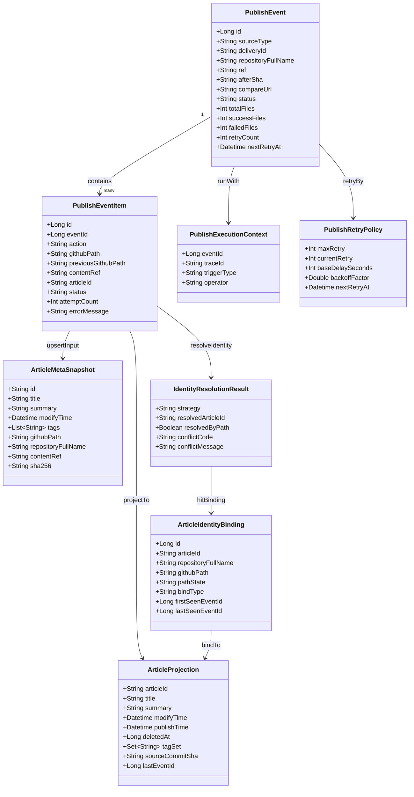
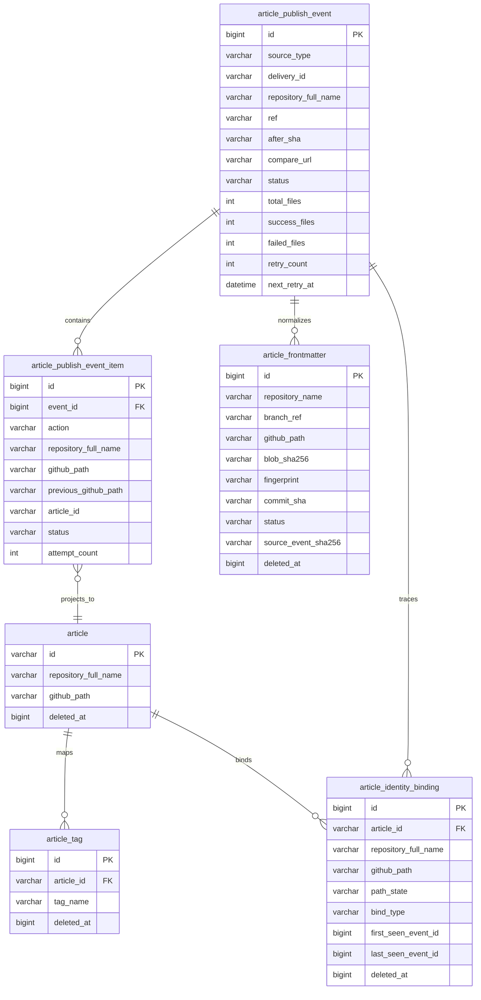
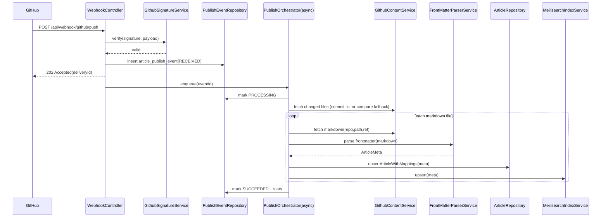
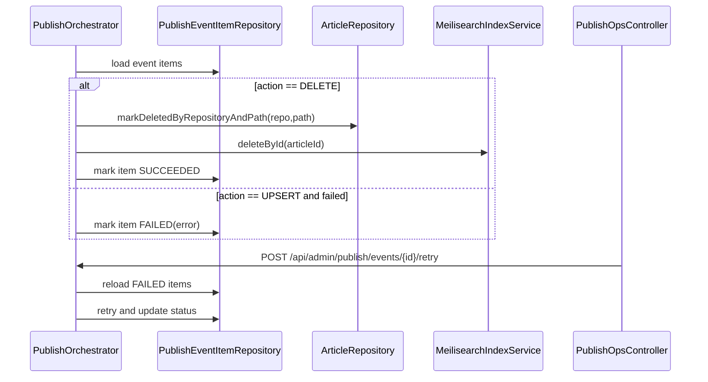
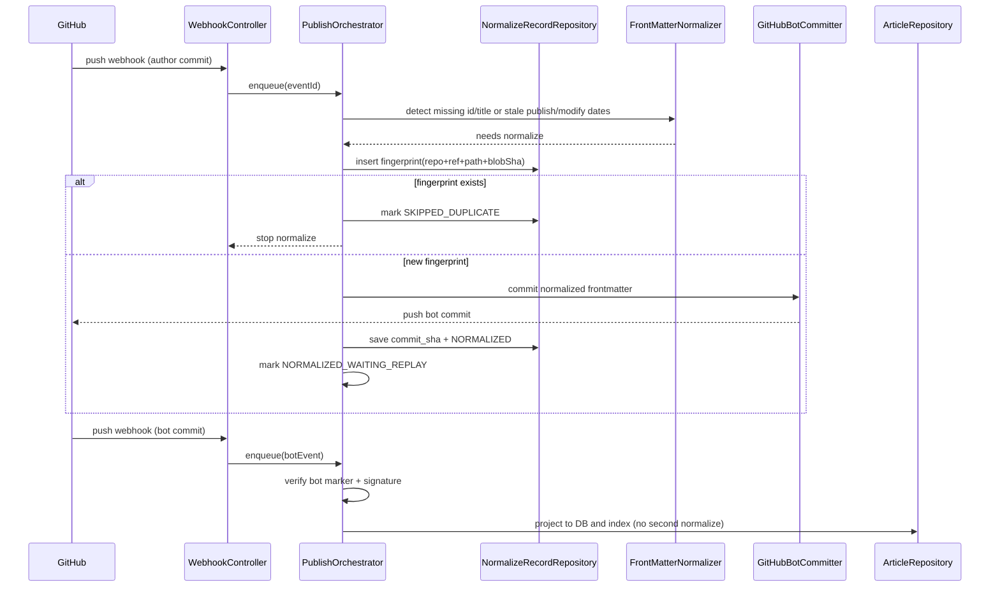

# 文章发布流程详细设计（基于现有实现逆向 + 优化方案）

最后更新：2026-03-27  
适用范围：`iterlife-reunion` 后端（GitOps 发布链路）

说明：本文档同时包含“当前实现逆向”与“剩余优化方案”。`article_publish_event` / `article_publish_event_item` 与专用发布线程池已经在当前代码中落地；`Ops API`、身份绑定历史、索引 outbox 等仍属于后续设计。

## 1. 背景与目标

本文档聚焦“发布文章”流程，不覆盖后台文章管理模块（该模块设计已另行保留）。
阅读侧 Markdown 渲染、代码高亮、图片预览与 `heading anchor` 方案属于 `reunion-ui` 范围，不在本文展开；详见 `../../reunion-ui/design/article-reader-rendering.md`。

目标：
1. 基于当前代码逆向还原真实发布链路。
2. 在保持现有对外读 API 不变的前提下，给出可落地的优化设计。
3. 输出可直接用于开发的 API、数据库、时序方案。

非目标：
1. 不改动前台读取接口语义（`/api/articles/**`）。
2. 不引入新的写作入口（仍以 Git Push 触发发布）。

## 2. 现状逆向（Current State）

当前发布主链路（已实现）：
1. GitHub Push 回调 `POST /api/webhook/github/push`。
2. 后端验签通过后先写入 `article_publish_event`，随后返回带 `eventId` 的 `202 Accepted`。
3. `ArticlePublishEventService` 通过独立线程池或定时恢复调度器分发待处理事件。
4. `ArticleSyncService` 基于持久化事件解析 commit 里的新增/修改/删除 Markdown 路径；若 commit 文件列表为空，回退到 compare API 拉取变更文件。
5. 对删除文件：逻辑删除 `article`，并从 Meili 删除文档。
6. 对新增/修改文件：必要时先做 FrontMatter 规范化与 bot 回写；最终解析 FrontMatter，upsert `article` + 重建 `article_tag` + upsert Meili。

### 当前实现详细时序图

说明：
1. 本图严格对应当前代码事实，主入口是 `WebhookController.receivePush`、`ArticlePublishEventService.acceptGithubPush` / `dispatchPendingEvents`、`ArticleSyncService.processPersistedEvent`、`ArticleFrontmatterService.normalizeChangedFilesIfNeeded`。
2. 当前实现已落 `article_publish_event` / `article_publish_event_item` 并使用专用线程池；`202 Accepted` 表示事件已验签并被系统接单，不表示文件级投影全部完成。
3. FrontMatter normalizer 开启时，新增/修改文件可能先触发 bot 回写，再由 replay push 或进程内兜底完成投影。
4. 为便于阅读和后续稳定性建设，当前已拆分为“主链路图”和“异步处理图”两张 PlantUML 图；二者都按“用户本地 / GitHub 侧 / IterLife Reunion 系统”明确执行归属。
PlantUML 源文件已单独存放，便于 IDE 直接渲染与后续维护：

- 主链路图：[article-publish-flow-main-sequence.puml](/Users/iter_1024/repository/iterlife-reunion-stack/docs/reunion/design/diagrams/article-publish-flow-main-sequence.puml)
- 异步 / 补偿风险图：[article-publish-flow-async-risk-sequence.puml](/Users/iter_1024/repository/iterlife-reunion-stack/docs/reunion/design/diagrams/article-publish-flow-async-risk-sequence.puml)

稳定性风险、建设项与验收建议已合并到本文后续章节，不再单独拆分 checklist 文档。

当前链路优点：
1. 读写解耦（Webhook 返回快，异步处理）。
2. 已支持删除、重命名兜底（compare fallback）。
3. 已具备 FrontMatter 自动补齐、防循环识别和重复投影跳过能力。
4. 与现有查询接口直接对接。

当前链路主要缺口：
1. 缺少可查询的后台补偿 / 重放 / 重建索引运维 API。
2. GitHub compare / contents / Meili 失败后的自动补偿策略仍较弱。
3. 身份绑定历史与冲突治理仍停留在设计态。
4. DB 投影与 Meili 同步仍是最终一致，尚未 outbox 化。

## 2.1 当前“GitHub 文章 -> Reunion 文章”对应关系（代码逆向）

当前实现不是单一键，而是三套键共同工作：
1. 主身份键：FrontMatter `id` -> `article.id`（`upsert` 以主键/唯一键冲突更新）。
2. 删除定位键：`repository_full_name + github_path`（删除时按仓库+路径逻辑删除）。
3. 读取路由键：`id`（详情接口 `GET /api/articles/{id}` 按 `id` 查询）。

现有增删改行为：
1. 新增：新文件解析出 `id`，直接 upsert 到 `article(id=frontmatter.id)`。
2. 修改：同一 `id` 的内容/元数据变化会覆盖更新同一文章记录。
3. 删除：按 `repository_full_name + github_path` 找文章并逻辑删除，再删 Meili 文档。
4. 重命名：旧路径被识别为 removed，新路径被识别为 changed；旧路径先删，同 `id` 新路径再 upsert 恢复为有效。

## 2.2 当前痛点（与一一对应直接相关）

1. 同路径改 `id` 缺少显式冲突治理：会触发“新旧身份切换”但没有审计与确认流程。
2. 删除链路按路径查 `article_id` 时未显式限定“仅有效记录”，历史软删行可能干扰定位精度。
3. 历史 `slug` 语义会制造“可读 URL != 稳定身份”的错觉，当前已直接使用 `id` 作为详情路由键。
4. 缺少“身份绑定历史”模型，难以回答“这篇文章曾经对应过哪些路径、何时切换”。

## 2.3 术语与语义约定（FrontMatter / id）

1. `FrontMatter`
- 指 Markdown 文件顶部 `---` 包裹的 YAML 元数据块。
- 在发布链路中承担文章元数据输入职责（`id/title/tags/publish_date/last_modify_date/summary/sha256`）。
- FrontMatter 统一采用“两列式”单行 `key: value` 管理；即使是 `tags` 也收敛为单行值，不再使用多行列表块。

3. 当前实现约束
- 当 normalizer 开启时，缺少 `id`/`title` 或需要刷新 `publish_date` / `last_modify_date` / `sha256` 的文件会先被规范化，再等待 bot replay 或回退为进程内投影。
- 当 normalizer 关闭或 FrontMatter 解析最终仍失败时，文件会被跳过，不参与发布入库。
- 详情读取与前端路由统一直接使用 `id`，不再维护 `slug`。

## 3. 优化总体方案

核心思想：在不破坏现有读取模型的前提下，为发布链路增加“事件层（Event Layer）”。

发布层次：
1. `Ingress`：接收 webhook、验签、落事件、快速 ACK。
2. `Orchestrator`：异步消费事件，拆分文件任务，控制重试与状态。
3. `Projector`：执行 `article` / `article_tag` / Meili 的具体投影更新。
4. `Ops API`：提供事件查询、重放、重试、重建能力。

演进策略：
1. `ArticleController` 与 `ArticleQueryService` 对外保持文章查询主路径稳定。
2. 现有 `ArticleSyncService` 逻辑逐步迁移到 Orchestrator/Projector。
3. 研发早期允许直接清理 `category/type` 冗余语义，以 `Tag` 作为唯一文章索引维度。

## 4. 领域对象设计

## 4.1 业务对象清单

1. `PublishEvent`
- 含义：一次发布事件聚合根（对应一次 webhook 或一次人工回放）。
- 职责：管理事件状态流转、统计信息、重试策略入口。

2. `PublishEventItem`
- 含义：事件内单文件处理项（UPSERT/DELETE）。
- 职责：承载文件级状态、错误信息、重试次数。

3. `ArticleMetaSnapshot`
- 含义：FrontMatter + 内容解析后的标准化快照（内存对象，不必落库）。
- 职责：向 `ArticleRepository` 和 `Meili` 投影层提供统一输入。

4. `PublishExecutionContext`
- 含义：发布执行上下文（repo/ref/afterSha/compareUrl/traceId/operator）。
- 职责：跨步骤传递链路信息，统一日志与审计。

5. `ArticleProjection`
- 含义：读模型文章实体投影（`article` + `article_tag`）。
- 职责：保证前台查询侧的一致可读。

6. `PublishRetryPolicy`
- 含义：重试与退避策略对象。
- 职责：计算 `nextRetryAt`、判定是否可继续自动重试。

7. `ArticleIdentityBinding`
- 含义：GitHub 文件与业务文章的身份绑定关系（可追踪历史）。
- 职责：维护 `articleId <-> (repository, path)` 的当前绑定与历史绑定。

8. `IdentityResolutionResult`
- 含义：单文件发布时的身份解析结果。
- 职责：输出命中策略（按 `id`、按路径、冲突）与后续动作（upsert/delete/conflict）。

## 4.2 主要属性（按对象）

| 对象 | 主要属性 | 说明 |
|---|---|---|
| `PublishEvent` | `id`, `sourceType`, `deliveryId`, `repositoryFullName`, `ref`, `afterSha`, `compareUrl`, `status`, `totalFiles`, `successFiles`, `failedFiles`, `retryCount`, `nextRetryAt`, `errorMessage`, `createdAt` | 事件级主记录 |
| `PublishEventItem` | `id`, `eventId`, `action`, `repositoryFullName`, `githubPath`, `previousGithubPath`, `contentRef`, `articleId`, `status`, `attemptCount`, `errorMessage`, `updatedAt` | 文件级处理记录 |
| `ArticleMetaSnapshot` | `id`, `title`, `summary`, `modifyTime`, `tags`, `githubPath`, `repositoryFullName`, `contentRef`, `plainText`, `sha256` | 解析后的标准元数据 |
| `PublishExecutionContext` | `eventId`, `traceId`, `repositoryFullName`, `ref`, `afterSha`, `compareUrl`, `triggerType`, `operator` | 发布链路上下文 |
| `ArticleProjection` | `articleId`, `title`, `summary`, `modifyTime`, `publishTime`, `deletedAt`, `tagSet`, `sourceCommitSha`, `lastEventId`, `lastSyncedAt` | 面向查询层的投影结果 |
| `PublishRetryPolicy` | `maxRetry`, `currentRetry`, `baseDelaySeconds`, `backoffFactor`, `nextRetryAt` | 重试参数与计算结果 |
| `ArticleIdentityBinding` | `id`, `articleId`, `repositoryFullName`, `githubPath`, `pathState`, `bindType`, `firstSeenEventId`, `lastSeenEventId`, `createdAt` | 文章与路径绑定关系（当前+历史） |
| `IdentityResolutionResult` | `strategy`, `resolvedArticleId`, `resolvedByPath`, `conflictCode`, `conflictMessage` | 身份解析与冲突结果 |

## 4.3 领域对象图



## 5. API 详细设计

## 5.1 Ingress API（外部）

### `POST /api/webhook/github/push`

用途：接收 GitHub Push 事件并快速响应。  
请求头：
1. `X-Hub-Signature-256`
2. `X-GitHub-Delivery`（新增用于幂等）

请求体：GitHub Push JSON（保持现状）。  
响应：
1. 当前实现：`{"message":"webhook accepted","repo":"...","commits":1,"ref":"refs/heads/main","deliveryId":"...","eventId":"123"}`  
2. `401 Unauthorized`：签名不合法  
3. `400 Bad Request`：payload 不合法

说明：
1. 当前实现仅做轻处理（验签 + 事件落库 + 轻量分发），不在 webhook 线程内做文件级处理。
2. 当前响应已经返回 `eventId`，但后台事件查询 / 重试 / 回放 API 仍未落地。

## 5.2 Ops API（内部/后台）

统一前缀：`/api/admin/publish`

### `GET /events`
用途：分页查询发布事件。  
查询参数：
1. `status`（可选）
2. `repo`（可选）
3. `from`、`to`（可选）
4. `page`、`size`

### `GET /events/{eventId}`
用途：查看单个事件详情和文件处理结果（含失败原因）。

### `POST /events/{eventId}/retry`
用途：重试失败事件。  
请求体：
1. `{"mode":"failed_only"}` 或 `{"mode":"all"}`。

### `POST /events/replay`
用途：手动补偿回放（按 repo + compare URL 或 repo + ref + sha）。

### `POST /reindex`
用途：按条件重建 Meili 索引（全量或按 repo）。

权限建议：
1. `publish:read`
2. `publish:retry`
3. `publish:replay`
4. `publish:reindex`

## 6. 数据库设计

## 6.1 已落地表：`article_publish_event`

用途：发布事件主表（事件级生命周期）。

| 字段 | 类型 | 约束/默认值 | 说明 |
|---|---|---|---|
| `id` | BIGINT | PK, AUTO_INCREMENT | 事件主键 |
| `source_type` | VARCHAR(32) | NOT NULL | `GITHUB_PUSH`/`MANUAL_REPLAY` |
| `delivery_id` | VARCHAR(128) | NULL | GitHub 投递 ID |
| `repository_full_name` | VARCHAR(255) | NOT NULL | 仓库全名 |
| `ref` | VARCHAR(255) | NULL | 分支引用 |
| `after_sha` | VARCHAR(64) | NULL | Push 后提交 SHA |
| `compare_url` | VARCHAR(512) | NULL | GitHub compare URL |
| `payload_json` | JSON | NOT NULL | 原始事件载荷 |
| `status` | VARCHAR(32) | NOT NULL | `RECEIVED`/`DISPATCHING`/`PROCESSING`/`SUCCEEDED`/`PARTIAL_FAILED`/`FAILED`/`RETRY_READY` |
| `total_files` | INT | NOT NULL DEFAULT 0 | 文件总数 |
| `success_files` | INT | NOT NULL DEFAULT 0 | 成功数 |
| `failed_files` | INT | NOT NULL DEFAULT 0 | 失败数 |
| `retry_count` | INT | NOT NULL DEFAULT 0 | 已重试次数 |
| `next_retry_at` | DATETIME | NULL | 下一次重试时间 |
| `error_message` | VARCHAR(1024) | NULL | 事件级错误摘要 |
| `deleted_at` | BIGINT | NOT NULL DEFAULT 0 | 软删除标记 |
| `created_at` | TIMESTAMP | DEFAULT CURRENT_TIMESTAMP | 创建时间 |
| `updated_at` | TIMESTAMP | DEFAULT CURRENT_TIMESTAMP ON UPDATE CURRENT_TIMESTAMP | 更新时间 |

索引建议：
1. `uk_article_publish_event_delivery (delivery_id, deleted_at)`（允许 `delivery_id` 为空）
2. `idx_article_publish_event_repo_ref (repository_full_name, ref, created_at)`
3. `idx_article_publish_event_status_next_retry (status, next_retry_at)`

## 6.2 已落地表：`article_publish_event_item`

用途：发布事件文件明细表（文件级可观测与重试基础）。

| 字段 | 类型 | 约束/默认值 | 说明 |
|---|---|---|---|
| `id` | BIGINT | PK, AUTO_INCREMENT | 明细主键 |
| `event_id` | BIGINT | NOT NULL | 归属事件 ID |
| `action` | VARCHAR(16) | NOT NULL | `UPSERT`/`DELETE` |
| `repository_full_name` | VARCHAR(255) | NOT NULL | 仓库全名 |
| `github_path` | VARCHAR(255) | NOT NULL | 当前文件路径 |
| `previous_github_path` | VARCHAR(255) | NULL | 重命名前路径 |
| `content_ref` | VARCHAR(128) | NULL | 内容引用（commit/ref） |
| `article_id` | VARCHAR(64) | NULL | 解析后的文章 ID |
| `status` | VARCHAR(32) | NOT NULL | `PENDING`/`PROCESSING`/`SUCCEEDED`/`FAILED`/`SKIPPED` |
| `attempt_count` | INT | NOT NULL DEFAULT 0 | 处理次数 |
| `error_message` | VARCHAR(1024) | NULL | 文件级错误详情 |
| `deleted_at` | BIGINT | NOT NULL DEFAULT 0 | 软删除标记 |
| `created_at` | TIMESTAMP | DEFAULT CURRENT_TIMESTAMP | 创建时间 |
| `updated_at` | TIMESTAMP | DEFAULT CURRENT_TIMESTAMP ON UPDATE CURRENT_TIMESTAMP | 更新时间 |

索引建议：
1. `idx_article_publish_event_item_event (event_id, status)`
2. `idx_article_publish_event_item_repo_path (repository_full_name, github_path, deleted_at)`
3. `uk_article_publish_event_item_unique (event_id, action, github_path, deleted_at)`

## 6.3 读模型增强（`article` 可选增量列）

| 字段 | 类型 | 约束 | 说明 |
|---|---|---|---|
| `source_commit_sha` | VARCHAR(64) | NULL | 最后一次投影来源 commit |
| `last_event_id` | BIGINT | NULL | 最后一次发布事件 ID |
| `last_synced_at` | DATETIME | NULL | 最后同步时间 |
| `sha256` | VARCHAR(64) | NULL | 正文 SHA-256 指纹，辅助判断正文是否变化 |

## 6.4 新增表：`article_identity_binding`

用途：显式记录“文章 ID 与 GitHub 路径”的当前绑定和历史绑定，解决增删改过程中的身份追踪问题。

| 字段 | 类型 | 约束/默认值 | 说明 |
|---|---|---|---|
| `id` | BIGINT | PK, AUTO_INCREMENT | 绑定记录主键 |
| `article_id` | VARCHAR(64) | NOT NULL | 对应 `article.id` |
| `repository_full_name` | VARCHAR(255) | NOT NULL | 仓库全名 |
| `github_path` | VARCHAR(255) | NOT NULL | GitHub 文件路径 |
| `path_state` | VARCHAR(16) | NOT NULL | `CURRENT`/`HISTORY` |
| `bind_type` | VARCHAR(32) | NOT NULL | `BY_ID`/`BY_PATH_FALLBACK`/`MANUAL` |
| `first_seen_event_id` | BIGINT | NULL | 首次出现的发布事件 ID |
| `last_seen_event_id` | BIGINT | NULL | 最近一次命中的发布事件 ID |
| `deleted_at` | BIGINT | NOT NULL DEFAULT 0 | 软删除标记 |
| `created_at` | TIMESTAMP | DEFAULT CURRENT_TIMESTAMP | 创建时间 |
| `updated_at` | TIMESTAMP | DEFAULT CURRENT_TIMESTAMP ON UPDATE CURRENT_TIMESTAMP | 更新时间 |

索引建议：
1. `uk_identity_repo_path (repository_full_name, github_path, deleted_at)`（同一路径只允许一个有效绑定）
2. `idx_identity_article_state (article_id, path_state, deleted_at)`
3. `idx_identity_last_seen (last_seen_event_id)`

## 6.5 ER 图



## 6.6 新增表：`article_frontmatter`（防循环幂等）

用途：记录系统“自动补写 FrontMatter”执行痕迹，防止 bot 回推导致重复补写与循环执行。

| 字段 | 类型 | 约束/默认值 | 说明 |
|---|---|---|---|
| `id` | BIGINT | PK, AUTO_INCREMENT | 主键 |
| `repository_name` | VARCHAR(255) | NOT NULL | 仓库全名 |
| `branch_ref` | VARCHAR(255) | NOT NULL | 分支引用（如 `refs/heads/main`） |
| `github_path` | VARCHAR(255) | NOT NULL | 文件路径 |
| `blob_sha256` | VARCHAR(64) | NOT NULL | 本次处理前文件内容哈希/对象标识 |
| `fingerprint` | VARCHAR(128) | NOT NULL | 幂等指纹（如 `repo+ref+path+blobSha`） |
| `commit_sha` | VARCHAR(64) | NULL | 补写后 bot 提交 SHA |
| `status` | VARCHAR(32) | NOT NULL | 当前实现使用 `PENDING`/`NORMALIZED`/`FAILED` |
| `source_event_sha256` | VARCHAR(64) | NULL | 来源事件 SHA（当前按 source event hash 存储） |
| `deleted_at` | BIGINT | NOT NULL DEFAULT 0 | 软删除标记 |
| `created_at` | TIMESTAMP | DEFAULT CURRENT_TIMESTAMP | 创建时间 |
| `updated_at` | TIMESTAMP | DEFAULT CURRENT_TIMESTAMP ON UPDATE CURRENT_TIMESTAMP | 更新时间 |

索引建议：
1. `uk_normalize_fingerprint (fingerprint, deleted_at)`。
2. `idx_normalize_repo_ref_path (repository_name, branch_ref, github_path, deleted_at)`。
3. `idx_normalize_source_event (source_event_sha256)`。

## 7. 时序图设计

## 7.1 标准发布（Push -> 发布成功）



## 7.2 删除/重命名与补偿重试



## 7.3 FrontMatter 自动补写 + bot 回推发布



## 8. 关键算法与规则

## 8.1 幂等键策略

优先级：
1. `X-GitHub-Delivery`（首选）
2. `repository_full_name + after_sha`（兜底）

规则：
1. 已存在且状态为 `PROCESSING`/`SUCCEEDED` 时，直接 ACK 并记录 duplicate。
2. 已存在且状态为 `FAILED` 时，可按策略触发自动重试或人工重试。

## 8.2 分支过滤

沿用现有 `iterlife.github.sync-branches`。  
非目标分支事件记录为 `SKIPPED`（便于审计），不进入文件处理。

## 8.3 失败重试

建议策略：
1. 自动重试 3 次（指数退避：1m/5m/15m）。
2. 超限后置 `FAILED`，等待人工 `retry`。
3. 单文件失败不阻断其他文件，事件可进入 `PARTIAL_FAILED`。

## 8.4 GitHub 与 Reunion 文章一一对应规则（重点）

### 8.4.1 身份解析优先级

单文件处理时，按以下优先级解析“目标文章是谁”：
1. `BY_ID`：优先使用 FrontMatter `id` 命中 `article.id`。
2. `BY_PATH_FALLBACK`：若 `id` 首次出现，则用 `(repository_full_name, github_path)` 命中 `article_identity_binding` 或当前读模型路径。
3. `CONFLICT`：当 `id` 与路径分别命中不同文章时，标记冲突，不自动覆盖。

### 8.4.2 增删改映射决策表

| 场景 | GitHub 变化 | FrontMatter `id` | 解析结果 | 目标动作 |
|---|---|---|---|---|
| 新增文章 | 新路径新增 | 新 `id` | `BY_ID`（新建） | 新建 `article` + 新建 `article_identity_binding(CURRENT)` |
| 修改文章 | 同路径 modified | 不变 | `BY_ID`（命中） | 更新同一 `article`，刷新标签与索引 |
| 删除文章 | 路径 removed | 不可读 | `BY_PATH_FALLBACK` | 按路径绑定定位 `article_id`，逻辑删除 + 绑定转 `HISTORY` |
| 重命名（`id` 不变） | old removed + new changed | 不变 | 先 `BY_PATH_FALLBACK` 再 `BY_ID` | 旧路径绑定置 `HISTORY`，新路径绑定置 `CURRENT`，文章实体保持同一 `id` |
| 同路径改 `id` | path modified | 变化 | `CONFLICT` | 记录冲突并暂停自动发布，等待人工确认“继承旧文章”或“新建文章” |
| 重命名且改 `id` | old removed + new changed | 变化 | 默认 `CONFLICT` | 同上，禁止静默迁移，避免评论/统计挂错文章 |

### 8.4.3 冲突治理策略

1. 冲突入库到 `article_publish_event_item`（建议补充 `conflict_code`、`conflict_detail` 字段）并标记事件 `PARTIAL_FAILED`。
2. Ops 侧提供人工处理动作：
- `rebind_to_existing(articleId)`：路径改绑到存量文章。
- `create_new_article(newArticleId)`：确认新文章身份，保留旧文章历史。
3. 人工决策落地后，系统重放当前 `event_item`，保证结果可追溯、可审计。

## 8.5 FrontMatter 自动补全与更新规则（本轮确认）

### 8.5.1 字段策略

1. `id`
- 缺失时由系统根据 `repositoryFullName + githubPath` 生成确定性 UUID，并回写到文档 FrontMatter。
- 一旦生成并落库，后续更新必须复用，不允许系统侧重新分配。

2. `title`
- `title` 仍是发布所需字段。
- 当 `title` 为空时，允许使用 `github_path` 的文件名（去扩展名）作为兜底值。
- 推荐兜底顺序：`FrontMatter.title` -> 既有文章标题（同 `id`） -> 文件名。

3. `publish_date`
- 语义定义为“首次发布时间（first_published_at）”。
- 格式固定为 `yyyy-MM-dd HH:mm:ss`。
- 优先复用 FrontMatter 已有值；若已有数据库快照，则复用数据库 `publish_time`。
- 当 FrontMatter 缺失且数据库也无历史记录时，首次规范化写入当前时间。

4. `last_modify_date`
- 语义定义为“最后修改时间（last_modified_at）”。
- 格式固定为 `yyyy-MM-dd HH:mm:ss`。
- 当系统检测到正文文本发生变化（通过 `sha256` 对比）时，自动更新为当前时间，并回写 FrontMatter 的 `last_modify_date`。
- 若正文未变，则优先复用 FrontMatter 现值；若缺失，则回退到数据库 `modify_time` 或 `publish_date`。

5. `tags` / `summary`
- `tags` 规范化时始终写成单行逗号分隔值。
- 当存在数据库有效标签时，以数据库有效标签列表为准回写 `tags`，并按文章内标签顺序字段 `article_tag.tag_order` 排序。
- 若数据库无有效标签且 FrontMatter 未提供 `tags`，当前阶段写回空值，不自动生成语义标签。
- `summary` 始终入库；当文件进入投影时，数据库 `summary` 以 FrontMatter 当前值覆盖更新。
- `tags` 由作者维护；投影时按最新 FrontMatter 重建该文章的标签引用集。
- 预留后续 AI 自动补全能力。

6. FrontMatter 必要性
- 文章发布最终形态必须包含 FrontMatter。
- 对于缺失 FrontMatter 的新增文档，系统先自动补头并回写，再进入后续发布。

### 8.5.2 发布时序调整

1. 系统检测到缺失 `id` / `title` / `publish_date` / `last_modify_date` 或需更新 `sha256` 时，先进入 `NORMALIZE_FRONTMATTER`。
2. 生成并回写 FrontMatter 后，由 bot 提交到 GitHub。
3. bot 回推成功时，当前事件等待 replay；bot 回推失败时，当前实现会回退为进程内投影，避免同步完全中断。
4. 当 replay 到达时，系统通过 bot marker + HMAC + `article_frontmatter.fingerprint` 识别为已规范化事件，直接进入投影入库。

### 8.5.3 风险登记（待决）

1. `bot` 提交防循环（自触发 webhook 循环）已在当前实现中落地，核心依赖 commit trailer 标记、HMAC 签名与 `article_frontmatter` 指纹幂等。
2. 分支保护与 bot 写权限策略待定，列为待决风险项。
3. 并发改文场景下的补写冲突处理（rebase/retry）待定，列为待决风险项。

### 8.5.4 字段来源矩阵（FrontMatter vs GitHub）

| 字段 | 首选来源 | 兜底来源 | 说明 |
|---|---|---|---|
| `id` | FrontMatter | 系统生成稳定 UUID | 业务身份主键；缺失时先补写回 Git |
| `title` | FrontMatter | 文件名（`github_path`）/同 `id` 旧值 | 保障可读性与发布可用性 |
| `tags` | FrontMatter | 数据库有效 tag 列表 / 空值 | 单行逗号分隔；当存在数据库有效 tag 时，规范化回写以数据库有效 tag 为准，并按 `article_tag.tag_order` 排序 |
| `publish_date` | FrontMatter | 数据库 `publish_time` / 首次规范化当前时间 | 固定格式 `yyyy-MM-dd HH:mm:ss`，用于表达首次发布时间 |
| `last_modify_date` | FrontMatter | 数据库 `modify_time` / 正文变更时系统写当前时间 | 固定格式 `yyyy-MM-dd HH:mm:ss`，入库映射为 `modify_time` |
| `summary` | FrontMatter | 空值 | 入库用于列表快速读取；正文未变也允许单独更新 |
| `sha256` | FrontMatter | 系统基于正文计算 | 用于判断正文是否变化并驱动 `last_modify_date => modify_time` 更新 |
| `repository_full_name` | Webhook payload | 无 | 来自 GitHub 事件 |
| `github_path` | commit/compare 文件清单 | 无 | 删除/重命名定位关键 |
| `content_ref` | `after` SHA | 默认分支 | 用于读取具体版本内容 |

### 8.5.5 FrontMatter 示例（建议）

推荐完整模板（作者可显式维护）：

```yaml
---
id: 3f0b7d4d-7f6d-4c47-8f15-3a8bcb8fb77f
title: Build a Reliable Publish Pipeline
tags: engineering, backend, architecture
publish_date: 2026-03-10 21:30:00
last_modify_date: 2026-03-26 21:50:00
summary: How we make GitHub-based article publishing observable and recoverable.
sha256: 6f08ecde9f6d3f30bc9fd6f2ad7ce6f0f8fb31aa74f8f65b0b4a0eb0d8b31876
---
```

最小可用模板（其余字段允许系统兜底）：

```yaml
---
id: 3f0b7d4d-7f6d-4c47-8f15-3a8bcb8fb77f
title: Build a Reliable Publish Pipeline
---
```

## 8.6 bot 提交防循环设计（详细）

### 8.6.1 问题定义

当系统自动补写 FrontMatter 并由 bot push 后，会触发新的 webhook。  
若系统无法识别该事件并再次进入补写流程，可能形成“补写 -> push -> webhook -> 再补写”的循环。

### 8.6.2 循环触发条件

1. 不能识别“系统自己产生的 push 事件”。
2. 补写逻辑非幂等（例如每次都把 `last_modify_date` 写成当前时间）。
3. 缺少文件级幂等记录（同一文件同一内容被重复补写）。
4. 重试与并发 worker 叠加导致重复执行。

### 8.6.3 方案清单（可行性对比）

| 方案 | 核心机制 | 优点 | 局限 |
|---|---|---|---|
| 来源过滤 | 识别 `sender/pusher` 是否 bot | 成本低、接入快 | 仅身份判断，安全性不足 |
| 提交标记 + HMAC | bot commit 写入标记并验签 | 可防伪造、可追踪 | 实现复杂度中等 |
| 文件指纹幂等 | `repo+ref+path+blobSha` 去重 | 从根上防重复补写 | 需新增记录表 |
| 状态机拆分 | `NORMALIZING -> WAITING_REPLAY -> PROJECTING` | 可观测、可回放 | 需要改造编排流程 |
| 循环保险丝 | `normalize_depth` 阈值熔断 | 防止极端风暴 | 需要配套告警 |

### 8.6.4 推荐最小上线组合（MVP）

1. bot 提交标记 + HMAC 验签（识别系统提交）。
2. 文件指纹幂等表（`article_frontmatter`）。
3. FrontMatter `last_modify_date` 仅在正文 `sha256` 变化时更新，格式固定为 `yyyy-MM-dd HH:mm:ss`，入库映射到 `modify_time`；`publish_date` 尽量保持首次发布时间稳定。
4. 事件状态机拆分为“补写事件”和“投影事件”。
5. 增加 `normalize_depth <= 1` 保险丝与告警。

### 8.6.5 事件判定规则（落地）

1. 接收 webhook 后先做验签（GitHub 原生签名）。
2. 若 `sender/pusher` 为 bot，继续校验 commit trailer 中的系统签名。
3. 验签通过且命中系统标记：禁止再次补写，直接进入投影阶段。
4. 非系统标记事件：按 FrontMatter 规则判定是否需要补写。
5. 任一步异常则记录 `article_publish_event_item` 错误并进入人工补偿路径。

## 9. 发布相关 API 与数据演进

演进原则：
1. 对外文章读取主路径保持稳定：`/api/articles/**`。
2. `article`、`article_tag` 仍为读模型事实来源，但 `article_tag` 已清理为纯 `tag_name` 结构。
3. 研发早期允许直接删除 `category/type` 语义与相关冗余结构，不保留兼容层。

### 9.1 2026-03-13 已落地实现修正

1. 查询展示层已从历史 `Type/Tag` 语义收敛为统一 `Tag` 视图。
2. `article_tag` 表结构已简化为纯 `tag_name`，不再保留 `category_name`。
3. 查询接口与前端筛选均移除 `categories` / `type` 语义，仅保留 `tags`。
4. 文章详情接口新增 GitHub 编辑入口字段，前台详情页支持：
   - 返回文章列表
   - 打开 GitHub `Edit on GitHub` 页面，必要时由 GitHub 引导用户 fork 后编辑
5. 当前 `ArticleSyncService` 已增加链路级日志字段（`deliveryId/repo/ref/afterSha`）和文件级投影结果日志。
6. 当前投影层已增加“重复内容跳过”保护：仅当同一 `repo + githubPath` 的有效文章 `sha256` 与关键元数据（`title/summary/last_modify_date/tags`）均未变化时，重复 webhook / replay 才跳过投影。

## 10. 落地步骤（建议）

### Phase 1：已完成
1. `article_publish_event`、`article_publish_event_item` 已建表并接入主链路。
2. webhook 已返回 `eventId`，事件线程池与恢复调度器已接入。
3. 文件级状态已可在数据库层追踪。

### Phase 2：待补偿化
1. 上线 `GET /events`、`GET /events/{id}`、`POST /events/{id}/retry`。
2. 增加 compare / contents / normalizer replay 失败后的自动或人工补偿能力。

### Phase 3：待运维化
1. 增加 `replay`、`reindex`。
2. 增加指标：成功率、平均耗时、失败分布、线程池队列深度。

## 11. 验收标准

1. webhook 重复投递不会造成重复写污染。
2. 发布失败可在后台定位到具体文件与错误原因。
3. 人工可对失败事件一键重试并观察结果。
4. 前台文章读取链路无回归，响应和数据结构不变。
5. 缺失 `id` 的新增文档可被系统补齐为稳定 UUID 并完成后续发布。
6. 正文发生变化时，FrontMatter `last_modify_date` 与数据库 `modify_time` 会按规则更新为最新时间；`publish_date` 与数据库 `publish_time` 保持首次发布时间稳定。

## 12. 稳定性建设清单

### 12.1 目标

本章节基于当前代码事实，整理文章发布链路的稳定性风险、影响面与建设建议，供后续分阶段落地。

适用链路：

1. `POST /api/webhook/github/push`
2. `ArticlePublishEventService.acceptGithubPush` / `dispatchPendingEvents`
3. `GithubCompareService` / `GithubContentService`
4. `ArticleFrontmatterService` / `FrontMatterNormalizerService`
5. `ArticleRepository` / `MeilisearchIndexService`

关联设计图：

- 主链路图：[article-publish-flow-main-sequence.puml](/Users/iter_1024/repository/iterlife-reunion-stack/docs/reunion/design/diagrams/article-publish-flow-main-sequence.puml)
- 异步 / 补偿风险图：[article-publish-flow-async-risk-sequence.puml](/Users/iter_1024/repository/iterlife-reunion-stack/docs/reunion/design/diagrams/article-publish-flow-async-risk-sequence.puml)

### 12.2 当前总体判断

当前链路已经具备以下优点：

1. webhook 可快速 ACK，请求侧体验较好。
2. 支持 commit 文件列表缺失时的 compare fallback。
3. 支持 FrontMatter 自动规范化、防循环和 replay 协调。
4. 单文件失败不会阻断整批处理。

当前链路最核心的稳定性短板也比较明确：

1. 虽然事件已落库，但 `202 Accepted` 仍只表示“系统接单”，不表示文章已经完成投影。
2. 缺少系统级 Ops API，运维仍难以直接查询、重试、回放和重建。
3. compare / contents / normalizer replay 的自动补偿能力仍偏弱。
4. DB 投影与 Meili 同步不在同一事务内，可能出现搜索索引不一致。
5. 单次 push 的文件数量、payload 规模、外部 API 调用量都没有保护阈值。

### 12.3 建设清单

| ID | 风险项 | 当前证据 | 影响面 | 建议建设项 | 优先级 |
|---|---|---|---|---|---|
| R1 | `202 Accepted` 与最终投影完成时间存在天然间隙 | webhook 线程只负责验签、落事件、尝试分发；实际投影在后台线程中完成 | 调用方容易误判“GitHub Action 结束 = 文章已完成部署” | 在文档、日志和后续 Ops API 中明确区分 accepted / processing / finished 三类状态 | P0 |
| R2 | 事件虽已落库，但缺少事件查询与人工补偿入口 | 已存在 `article_publish_event` / `article_publish_event_item`，但未提供后台查询 / 重试 / 回放 API | 运维仍需直接查数据库或日志，恢复成本高 | 落地 `GET /events`、`GET /events/{id}`、`POST /events/{id}/retry`、`POST /events/replay` | P0 |
| R3 | `deliveryId` 幂等仅覆盖 GitHub 原生投递场景 | 仓库已按 `delivery_id` 去重，但尚无统一的手工 replay / reindex 入口 | 人工补偿或未来多来源事件接入时，幂等边界不够统一 | 将人工 replay 纳入同一事件层，并为非 GitHub 入口补充幂等键策略 | P1 |
| R4 | 单次 push 无文件数 / 请求体 / 处理量保护 | 当前代码未看到上限控制 | 大批量改动时耗时不可预测，易拖垮线程池与外部 API | 增加 webhook payload 大小限制、单批最大 Markdown 文件数、超阈值转离线重建任务 | P1 |
| R5 | compare fallback 失败后仍缺少自动重试与补偿编排 | compare API 失败时会影响文件发现，但当前没有专门的 compare 重试策略 | commit 文件列表为空时可能导致整批文件发现不完整 | 对 compare 失败增加事件级重试分类、指数退避和人工重放入口 | P1 |
| R6 | 单文件 contents 拉取失败虽已落库，但尚无自动文件级重试 | 文件项可标记 `FAILED`，但当前没有单文件自动重试 / 手工重试 API | 某些文章仍可能长期停留在失败状态 | 基于 `article_publish_event_item` 增加文件级重试策略与运维操作 | P1 |
| R7 | FrontMatter / 解析失败的可观测性仍主要依赖数据库明细 | 失败会沉淀到文件项状态，但当前没有统一查询视图 | 内容存在但无法投影时，问题定位仍不够直观 | 提供事件详情视图，展示最近失败原因、阶段和时间 | P1 |
| R8 | normalizer replay 依赖 GitHub 二次 push | bot 回写成功后当前批次只做 `replayDeferred` | GitHub 二次 webhook 异常时可能造成长期不一致 | 增加“已规范化但未投影”的超时扫描任务，主动补投影 | P1 |
| R9 | DB 投影与 Meili 同步非事务一致 | `upsertArticleWithMappings` 后再调用 `meilisearchIndexService.upsert` | DB 成功但搜索结果滞后或缺失 | 以 outbox / `article_publish_event` 方式异步同步索引，支持失败重试和对账 | P1 |
| R10 | 缺少发布结果查询视图 | 当前主要依赖日志 | 无法快速回答“哪次 webhook 处理了哪些文件、哪些失败” | 增加事件列表、详情页、按 deliveryId / repo / articleId 检索能力 | P1 |
| R11 | 缺少可操作补偿 API | 当前只能靠再次 push 或 GitHub replay | 运维恢复效率低，人工成本高 | 提供“重放事件”“重试失败文件”“重建单篇文章”“重建索引”运维 API | P1 |
| R12 | 删除链路只按 repo + path 命中活跃记录 | 当前删除定位依赖 `repository_name + github_path` | 复杂迁移、身份漂移场景下审计能力有限 | 增加文章身份绑定历史表，显式记录路径迁移和身份切换 | P2 |
| R13 | 大批量串行拉取 GitHub contents API | 当前 changed 文件逐个拉取正文 | 批量发布时耗时高，易触发 GitHub API 限额 | 控制并发拉取、增加限流与重试、必要时引入批量重建任务 | P2 |
| R14 | 缺少统一超时治理 | compare / contents / normalizer / meili 没有统一任务级超时 | 异常外部依赖可能拖住整个批次 | 为事件、文件、外部请求设置超时并输出分类指标 | P2 |
| R15 | 缺少链路指标与告警 | 当前主要是结构化日志 | 故障发现依赖人工看日志 | 增加指标：ack 数、成功数、失败数、跳过数、队列深度、耗时分布、replayDeferred 数 | P0 |

### 12.4 关键证据点

以下是本清单对应的核心代码证据：

1. webhook 验签后先落事件并返回 `eventId`：
   - [WebhookController.java](/Users/iter_1024/repository/iterlife-reunion/src/main/java/com/iterlife/reunion/controller/WebhookController.java#L35)
   - [ArticlePublishEventService.java](/Users/iter_1024/repository/iterlife-reunion/src/main/java/com/iterlife/reunion/service/ArticlePublishEventService.java#L43)
2. 发布执行器与恢复调度器已经落地：
   - [ArticlePublishExecutorConfig.java](/Users/iter_1024/repository/iterlife-reunion/src/main/java/com/iterlife/reunion/config/ArticlePublishExecutorConfig.java#L10)
   - [ArticlePublishEventService.java](/Users/iter_1024/repository/iterlife-reunion/src/main/java/com/iterlife/reunion/service/ArticlePublishEventService.java#L71)
   - [IterlifeReunionApplication.java](/Users/iter_1024/repository/iterlife-reunion/src/main/java/com/iterlife/reunion/IterlifeReunionApplication.java#L10)
3. compare fallback 与文件级处理：
   - [ArticleSyncService.java](/Users/iter_1024/repository/iterlife-reunion/src/main/java/com/iterlife/reunion/service/ArticleSyncService.java#L143)
   - [GithubCompareService.java](/Users/iter_1024/repository/iterlife-reunion/src/main/java/com/iterlife/reunion/service/GithubCompareService.java#L35)
4. 事件与文件项仓储已落地：
   - [ArticlePublishEventRepository.java](/Users/iter_1024/repository/iterlife-reunion/src/main/java/com/iterlife/reunion/repository/ArticlePublishEventRepository.java#L17)
   - [ArticlePublishEventItemRepository.java](/Users/iter_1024/repository/iterlife-reunion/src/main/java/com/iterlife/reunion/repository/ArticlePublishEventItemRepository.java#L14)
5. normalizer 幂等与 replay 协调：
   - [ArticleFrontmatterService.java](/Users/iter_1024/repository/iterlife-reunion/src/main/java/com/iterlife/reunion/service/ArticleFrontmatterService.java#L68)
   - [ArticleFrontmatterService.java](/Users/iter_1024/repository/iterlife-reunion/src/main/java/com/iterlife/reunion/service/ArticleFrontmatterService.java#L90)
   - [ArticleFrontmatterRepository.java](/Users/iter_1024/repository/iterlife-reunion/src/main/java/com/iterlife/reunion/repository/ArticleFrontmatterRepository.java#L18)
6. DB 投影与 Meili 同步分离：
   - [ArticleRepository.java](/Users/iter_1024/repository/iterlife-reunion/src/main/java/com/iterlife/reunion/repository/ArticleRepository.java#L37)
   - [ArticleSyncService.java](/Users/iter_1024/repository/iterlife-reunion/src/main/java/com/iterlife/reunion/service/ArticleSyncService.java#L257)
   - [MeilisearchIndexService.java](/Users/iter_1024/repository/iterlife-reunion/src/main/java/com/iterlife/reunion/service/MeilisearchIndexService.java#L42)

### 12.5 推荐落地顺序

#### 第一阶段：先补“不会丢”和“看得见”

1. 指标与告警：最少先有 webhook ack、任务成功/失败、任务时长、队列深度
2. 运维查询：能按 `deliveryId`、仓库、commit、文章 ID 查处理结果
3. 统一 accepted / processing / finished 状态语义，避免把 ACK 误读为发布完成

#### 第二阶段：再补“能补偿”

1. 文件级失败重试
2. GitHub compare / contents 请求重试与退避
3. normalizer replay 超时补投影
4. 手工重放事件 / 单篇文章重建

#### 第三阶段：最后补“强一致和治理”

1. 索引 outbox 化
2. 身份绑定历史表
3. 大批量发布治理与离线重建
4. 更细的 SLA、超时和隔离策略

### 12.6 建议的最小验收标准

完成第一阶段后，建议至少满足以下标准：

1. 任意一次 webhook 都能在系统内查到事件记录。
2. 任意一次 JVM 重启后，不会无声丢失已 ACK 的发布任务。
3. 任意失败文件都能看到明确错误原因和最近一次失败时间。
4. 发布线程池容量、排队长度和拒绝次数可观测。
5. 运维可以按 `deliveryId` / `eventId` 快速确认“已接单”与“已完成”的差异。

## 13. 2026-03-27 增量需求设计

本节用于承接以下新增需求：

1. 文章列表、文章详情页元数据、FrontMatter 回写支持标签排序。
2. 文章列表支持置顶，默认最多置顶 3 篇且可配置。
3. GitHub `main` 分支 push 触发的文章解析任务必须先落库，再交由可配置线程池异步处理。
4. 个人信息复制邮件地址弹框、分享文章弹框、Support 弹框的 `Close` 按钮视觉与文章详情页保持一致。
5. 个人信息页 `Support` 模块默认展示。

说明：

1. 本节是“待实现设计”，当前代码尚未落地。
2. 为减少文档分片，展示层与发布链路的增量改动统一收口在本文。
3. 若无特殊说明，以下方案默认保持现有 API 主路径不变，仅扩充字段与排序语义。

### 13.1 标签排序设计

#### 13.1.1 目标

将标签顺序从“无序 / 自然顺序”收敛为“单篇文章内可排序顺序”，作用于：

1. 文章列表卡片元数据行。
2. 文章详情页元数据公共组件。
3. FrontMatter normalizer 回写 `tags` 字段。

非目标：

1. 本轮不实现标签管理后台。
2. 本轮不改造侧边栏标签云排序规则；侧边栏继续优先按文章数降序展示。

#### 13.1.2 数据模型

在 `article_tag` 表新增字段：

| 字段 | 类型 | 约束/默认值 | 说明 |
|---|---|---|---|
| `tag_order` | INT | NULL | 单篇文章内部标签顺序，越小越靠前；为空表示未排序 |

索引建议：

1. `idx_article_tag_article_order (article_id, deleted_at, tag_order, id)`

说明：

1. 排序语义限定在“单篇文章内部”，不是全局标签字典排序。
2. 本轮只引入“排序序号”，不引入独立管理端。
3. 运营可直接通过 SQL 更新同一篇文章下各条 `article_tag.tag_order` 达到排序目的。
4. `tag_order` 为空的标签视为“未排序”，默认排在已排序标签之后。

#### 13.1.3 排序规则

统一规则：

1. 单篇文章内，`tag_order IS NOT NULL` 的标签按 `tag_order ASC, id ASC` 排序。
2. `tag_order IS NULL` 的标签保留展示，但排在已排序标签之后。
3. 去重仍保持当前实现语义，不在本轮改动。

落点：

1. `ArticleQueryService`
   - `enrichTags` 阶段按 `article_tag.tag_order` 查询并返回单篇文章标签顺序。
2. `FrontMatterNormalizerService`
   - 回写 `tags` 时使用同一排序器，最终写成单行逗号分隔值。
3. 前端 `ArticleMetaLine`
   - 直接信任后端返回顺序，不再本地重新排序。

#### 13.1.4 兼容策略

1. 若文章全部标签都未设置 `tag_order`，则回退为当前行为：标签按文章投影顺序返回。
2. 若文章含未排序标签，不阻断展示、不阻断发布，仅追加到末尾。
3. 本轮不做“未排序标签自动剔除”，避免作者现有标签被静默清空。

#### 13.1.5 示例

假设某篇文章的 `article_tag` 记录如下：

| tag_name | tag_order |
|---|---|
| `AI` | 10 |
| `Web3` | 20 |
| `Rust` | 未设置 |

则：

1. 文章标签 `["Web3", "AI"]` -> 展示 / 回写为 `AI, Web3`
2. 文章标签 `["Rust", "AI", "Web3"]` -> 展示 / 回写为 `AI, Web3, Rust`

### 13.2 文章列表置顶设计

#### 13.2.1 目标

支持在文章列表中展示“最多 N 篇置顶文章”，其中：

1. 置顶文章独立按 `last_modify_date -> modify_time DESC` 排序。
2. 非置顶文章仍按 `last_modify_date -> modify_time DESC` 排序。
3. 默认最多置顶 3 篇，且上限可配置。

#### 13.2.2 数据模型

在 `article` 表新增字段：

| 字段 | 类型 | 约束/默认值 | 说明 |
|---|---|---|---|
| `is_pinned` | TINYINT(1) | NOT NULL DEFAULT 0 | 是否候选置顶 |

说明：

1. 本轮不增加后台管理端，由数据库直接维护 `is_pinned`。
2. 若数据库里被标记为 `is_pinned = 1` 的文章数量超过配置上限，只取“最后更新时间最近”的前 N 篇进入置顶区。
3. 超出上限的文章不会消失，而是回到普通列表区继续参与倒排。

#### 13.2.3 查询规则

配置项建议：

1. `iterlife.article.list.max-pinned: 3`

查询算法：

1. 先基于当前筛选条件（关键词 / tag）取出 `effectivePinnedIds`
   - 条件：`is_pinned = 1`
   - 排序：`modify_time DESC, publish_time DESC`
   - 限制：`LIMIT maxPinned`
2. 当 `page = 1` 时：
   - 列表顶部先返回 `effectivePinnedIds`
   - 再查询普通列表：排除 `effectivePinnedIds`，继续按 `modify_time DESC, publish_time DESC`
3. 当 `page > 1` 时：
   - 只查询普通列表
   - offset 需要减去第一页已消耗的 `effectivePinnedCount`
4. `total` 语义保持“匹配筛选条件的文章总数”，包含置顶与非置顶。

约束：

1. 默认假设 `maxPinned <= pageSize`。
2. 若未来允许 `maxPinned > pageSize`，需单独补充跨页置顶分段策略；本轮不展开。

#### 13.2.4 前端展示规则

1. 置顶文章不额外新增第二套卡片样式，本轮仅做排序与分组语义。
2. 卡片右上角增加轻量 `Pinned` 标识。
3. 文章详情页不展示“置顶”状态。

### 13.3 发布事件落库 + 可配置线程池

#### 13.3.1 目标

解决当前链路“202 已返回但任务仍可能因进程重启 / OOM / 执行器不可控而丢失”的问题。

#### 13.3.2 设计原则

1. webhook 验签成功后，先落 `article_publish_event`，再返回 `202 Accepted`。
2. 文件级处理过程全部可追踪到 `article_publish_event_item`。
3. 异步执行不再直接依赖默认 `@Async` 执行器，而是使用独立命名线程池。
4. 即使线程池提交失败，事件也不能丢；应保留在库中，等待调度器重新拾取。

#### 13.3.3 服务拆分

建议新增 / 重构为以下角色：

1. `PublishEventIngressService`
   - 负责 webhook 验签后的事件落库。
   - 落库内容至少包含：`delivery_id`、`repository_full_name`、`ref`、`after_sha`、`compare_url`、`payload_json`、`status=RECEIVED`。
2. `PublishEventDispatcher`
   - 从数据库加载 `RECEIVED` / `RETRY_READY` / `PROCESSING_STALE` 事件。
   - 向专用线程池提交 `eventId`。
3. `PublishEventProcessor`
   - 处理单个 `eventId` 的完整逻辑。
   - 内部可复用现有 `ArticleSyncService` 的文件发现、FrontMatter 处理、投影逻辑。
4. `PublishEventRecoveryScheduler`
   - 应用启动后和固定间隔扫描未完成事件，避免任务遗失。

#### 13.3.4 表设计补充

新增表：`article_publish_event`

| 字段 | 类型 | 约束/默认值 | 说明 |
|---|---|---|---|
| `id` | BIGINT | PK, AUTO_INCREMENT | 事件主键 |
| `source_type` | VARCHAR(32) | NOT NULL | `GITHUB_PUSH` / `MANUAL_REPLAY` |
| `delivery_id` | VARCHAR(128) | NULL | GitHub 投递 ID |
| `repository_full_name` | VARCHAR(255) | NOT NULL | 仓库全名 |
| `ref` | VARCHAR(255) | NULL | 分支引用 |
| `after_sha` | VARCHAR(64) | NULL | Push 后提交 SHA |
| `compare_url` | VARCHAR(512) | NULL | compare URL |
| `payload_json` | JSON | NOT NULL | 原始 webhook 载荷 |
| `status` | VARCHAR(32) | NOT NULL | `RECEIVED` / `DISPATCHING` / `PROCESSING` / `SUCCEEDED` / `PARTIAL_FAILED` / `FAILED` / `RETRY_READY` |
| `total_files` | INT | NOT NULL DEFAULT 0 | 文件总数 |
| `success_files` | INT | NOT NULL DEFAULT 0 | 成功文件数 |
| `failed_files` | INT | NOT NULL DEFAULT 0 | 失败文件数 |
| `retry_count` | INT | NOT NULL DEFAULT 0 | 事件重试次数 |
| `next_retry_at` | DATETIME | NULL | 下次自动重试时间 |
| `error_message` | VARCHAR(1024) | NULL | 事件级错误摘要 |
| `deleted_at` | BIGINT | NOT NULL DEFAULT 0 | 软删除标记 |
| `created_at` | TIMESTAMP | DEFAULT CURRENT_TIMESTAMP | 创建时间 |
| `updated_at` | TIMESTAMP | DEFAULT CURRENT_TIMESTAMP ON UPDATE CURRENT_TIMESTAMP | 更新时间 |

索引建议：

1. `uk_article_publish_event_delivery (delivery_id, deleted_at)`
2. `idx_article_publish_event_repo_ref (repository_full_name, ref, created_at)`
3. `idx_article_publish_event_status_next_retry (status, next_retry_at)`

新增表：`article_publish_event_item`

| 字段 | 类型 | 约束/默认值 | 说明 |
|---|---|---|---|
| `id` | BIGINT | PK, AUTO_INCREMENT | 明细主键 |
| `event_id` | BIGINT | NOT NULL | 归属 `article_publish_event.id` |
| `action` | VARCHAR(16) | NOT NULL | `UPSERT` / `DELETE` |
| `repository_full_name` | VARCHAR(255) | NOT NULL | 仓库全名 |
| `github_path` | VARCHAR(255) | NOT NULL | 当前文件路径 |
| `previous_github_path` | VARCHAR(255) | NULL | 重命名前路径 |
| `content_ref` | VARCHAR(128) | NULL | 内容引用 |
| `article_id` | VARCHAR(64) | NULL | 解析后的文章 ID |
| `status` | VARCHAR(32) | NOT NULL | `PENDING` / `PROCESSING` / `SUCCEEDED` / `FAILED` / `SKIPPED` |
| `attempt_count` | INT | NOT NULL DEFAULT 0 | 文件级处理次数 |
| `error_message` | VARCHAR(1024) | NULL | 文件级错误详情 |
| `deleted_at` | BIGINT | NOT NULL DEFAULT 0 | 软删除标记 |
| `created_at` | TIMESTAMP | DEFAULT CURRENT_TIMESTAMP | 创建时间 |
| `updated_at` | TIMESTAMP | DEFAULT CURRENT_TIMESTAMP ON UPDATE CURRENT_TIMESTAMP | 更新时间 |

索引建议：

1. `idx_article_publish_event_item_event (event_id, status)`
2. `idx_article_publish_event_item_repo_path (repository_full_name, github_path, deleted_at)`
3. `uk_article_publish_event_item_unique (event_id, action, github_path, deleted_at)`

#### 13.3.5 状态流转

事件状态建议：

1. `RECEIVED`
2. `DISPATCHING`
3. `PROCESSING`
4. `SUCCEEDED`
5. `PARTIAL_FAILED`
6. `FAILED`
7. `RETRY_READY`

文件项状态建议：

1. `PENDING`
2. `PROCESSING`
3. `SUCCEEDED`
4. `FAILED`
5. `SKIPPED`

关键规则：

1. webhook 线程只负责：
   - 验签
   - payload 解析
   - 事件落库
   - 尝试轻量投递 dispatcher
2. 真正的 compare / contents / normalizer / DB / Meili 逻辑只在 `PublishEventProcessor` 内执行。
3. 若 dispatcher 提交线程池失败：
   - 不回滚事件记录
   - 保持 `RECEIVED` 或标记 `RETRY_READY`
   - 由恢复调度器后续重新拾取

#### 13.3.6 线程池配置

建议新增配置：

```yaml
iterlife:
  article:
    list:
      max-pinned: ${ARTICLE_LIST_MAX_PINNED:3}
  publish:
    executor:
      core-pool-size: ${PUBLISH_EXECUTOR_CORE_POOL_SIZE:2}
      max-pool-size: ${PUBLISH_EXECUTOR_MAX_POOL_SIZE:4}
      queue-capacity: ${PUBLISH_EXECUTOR_QUEUE_CAPACITY:100}
      keep-alive-seconds: ${PUBLISH_EXECUTOR_KEEP_ALIVE_SECONDS:60}
      thread-name-prefix: ${PUBLISH_EXECUTOR_THREAD_NAME_PREFIX:publish-event-}
    dispatcher:
      batch-size: ${PUBLISH_DISPATCH_BATCH_SIZE:10}
      fixed-delay-ms: ${PUBLISH_DISPATCH_FIXED_DELAY_MS:5000}
      stale-processing-seconds: ${PUBLISH_STALE_PROCESSING_SECONDS:300}
```

线程池策略建议：

1. 使用显式 `ThreadPoolTaskExecutor`，名称建议为 `publishEventTaskExecutor`。
2. 拒绝策略不建议使用 `CallerRunsPolicy`，避免 webhook 请求线程被迫执行重活。
3. 推荐拒绝时只记录日志并保留事件在库中，由调度器补提。

#### 13.3.7 与当前实现的关系

1. 当前 `ArticleSyncService.handlePushAsync` 可逐步退化为同步处理器方法，例如 `processEvent(eventId)`。
2. `@Async` 注解不再作为主调度手段，仅保留在内部非关键路径时才考虑使用。
3. 现有事件层设计直接收敛命名为 `article_publish_event` / `article_publish_event_item`，不再使用泛化表名。

### 13.4 弹框 Close 按钮与 Support 默认展示

#### 13.4.1 Close 按钮统一规则

目标组件：

1. 邮件地址复制弹框：`ArticleUtilityDialog`
2. 分享文章弹框：`ArticleShareDialog`
3. Support 弹框：`ArticleSupportDialog`

统一要求：

1. 默认仅展示关闭图标。
2. hover / focus 时展开文案 `Close`。
3. 视觉、尺寸、过渡效果与文章详情页工具栏按钮保持一致。

实现建议：

1. 抽出共享样式类，例如沿用或扩展现有 `toolbar-button` / `toolbar-action-compact` / `toolbar-action-label`。
2. 三个弹框统一改为相同 DOM 结构，避免各自维护一套 Close 样式。
3. 若后续弹框数量继续增长，可再提炼 `ArticleDialogCloseButton` 公共组件；本轮可先用共享 CSS 类完成统一。

#### 13.4.2 Support 默认展示

目标：

1. 个人信息区域默认展示 `Support` 模块。
2. 无需等待管理端或运行时开关。

落点：

1. 前端配置 `articleProfileConfig.support.enabled` 默认调整为 `true`。
2. 侧边栏 `ArticleSidebarSupportCard` 默认可见。
3. `openSupportDialog`、`copySupportAddress` 的交互逻辑保持不变。
4. 范围仅限文章页个人信息侧边栏，不扩展到首页或其他页面。

### 13.5 实施顺序建议

建议按以下顺序实施，减少回归面：

1. 后端数据层
   - 为 `article_tag` 增加 `tag_order`
   - 为 `article` 增加 `is_pinned`
   - 落地 `article_publish_event` / `article_publish_event_item`
2. 后端查询与发布层
   - 标签排序器
   - 置顶查询逻辑
   - 事件落库 + dispatcher + 线程池
3. 前端展示层
   - 元数据标签顺序直接跟随后端
   - 列表置顶渲染
   - 三类弹框 `Close` 统一样式
   - `Support` 默认展示

### 13.6 待确认点

本轮设计默认采用以下假设，请确认后再进代码：

1. 未设置 `tag_order` 的标签“不剔除，只排在已排序标签之后”。
2. 置顶仅影响文章列表第一页，不额外影响详情页和侧边栏。
3. `Support` 默认展示仅指文章页个人信息侧边栏，不涉及首页单独增加 Support 区块。
