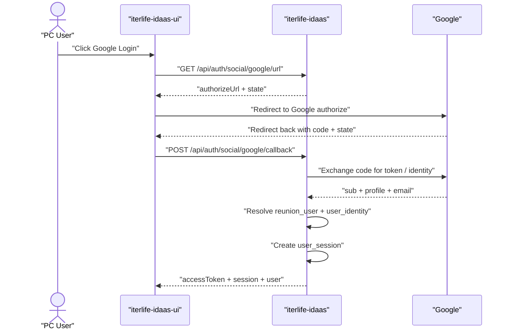
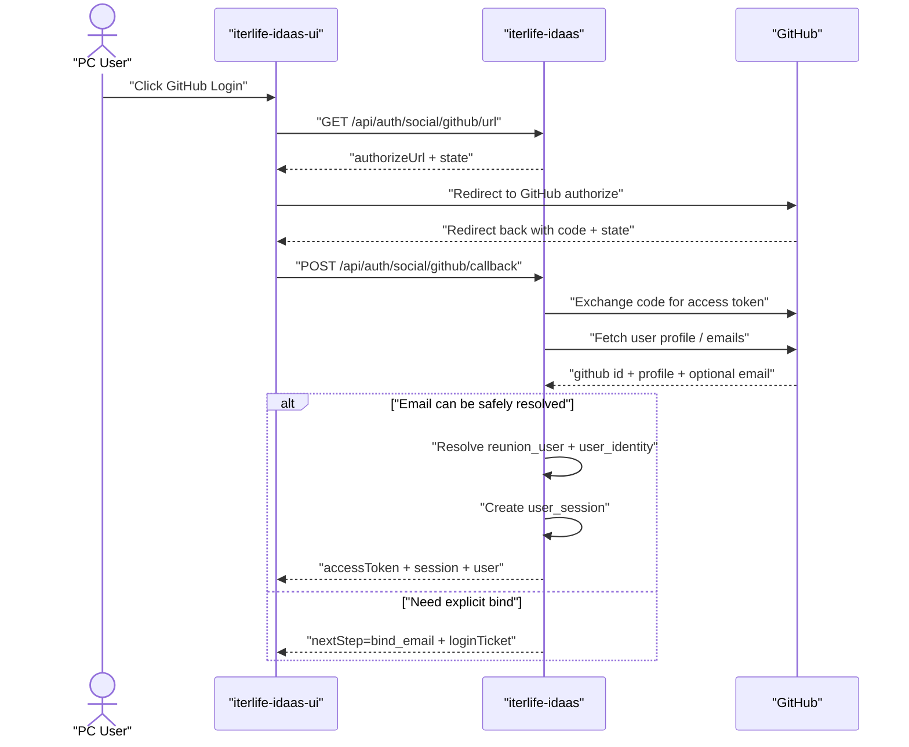
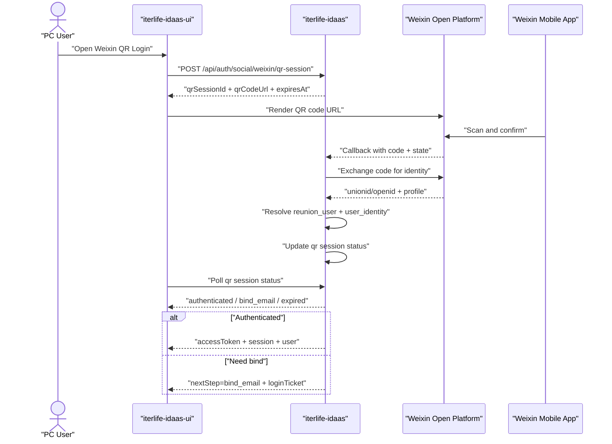

# 统一身份与授权设计（iterlife-idaas / iterlife-idaas-ui）

最后更新：2026-03-31  
适用范围：`iterlife-reunion`、`iterlife-reunion-ui`、`iterlife-expenses`、`iterlife-expenses-ui`、规划中的 `iterlife-idaas`、`iterlife-idaas-ui`

## 1. 文档目的

本文档用于统一以下事项：

1. 明确当前两套业务系统在认证、登出、会话、账户模型上的真实现状。
2. 将独立第三服务 `iterlife-idaas`、`iterlife-idaas-ui` 的职责边界定义清楚。
3. 给出“账户主数据收口的基础上认证先落地、授权分阶段上线”的可执行改造方案。

说明：

1. 当前最紧急改造目标是认证、登出、会话管理统一。
2. 账户数据统一归口与账户主档收口属于本次实现前提，不是仅预留项；认证必须建立在这一前提之上。
3. 本期只建设基于账户的能力；`reunion_user` 暂沿用现有表名承载统一账户主体，不在本期引入“用户-账户”分离模型。
4. 用户表与账户表的最终命名本期不拍板，待后续如确有“用户-账户”分离需求时再单独评审。
5. 权限模型、数据权限可以分阶段启用，但基础模型、主键口径和接口边界必须在本次设计中一次定义清楚。
6. 本文档优先描述真实现状与推荐落地路径，不追求一次性上齐完整 IAM/OIDC 全量能力。

配套产物：

1. 第一阶段接口清单已并入本文附录 A。
2. 第一阶段 DDL 草案已并入本文附录 B。

## 1.1 审阅摘要

为便于评审，本文最终版先给出核心结论：

1. 本期建设对象是“统一账户体系”，不是独立“用户中心”，也不引入“用户-账户”二层模型。
2. `reunion_user` 本期继续沿用为账户主体承载表名，但用户表与账户表的最终命名仍需后续单独评审。
3. 实施顺序必须是“先收口账户主数据与身份绑定，再落认证、会话与 SSO”。
4. 第一期认证范围固定为四种方式：用户名密码、Google、GitHub、微信 PC 扫码。
5. 微信移动端自动登录需要在架构上预留，但不纳入第一期实现范围，且当前优先级最低。
6. `iterlife-idaas` 作为独立认证微服务，`iterlife-idaas-ui` 作为轻量认证前端壳层，统一承接登录、绑定、扫码、会话管理等交互。
7. 技术选型建议为：
   - 后端：`Java 17 + Spring Boot 3.x + MyBatis-Plus`
   - 前端：`Nuxt 3 + Vue 3 + TypeScript`
   - 存储：`MySQL 8 + Redis`
8. 当前不直接引入完整现成 IAM 产品，而是在标准协议约束下自研满足当前账户统一与认证迁移需求的服务。
9. `sys_user` 已纳入本次改造的下线目标，但删除动作必须晚于 `reunion` 登录链路和评论链路的依赖迁移。

## 2. 当前现状基线

## 2.1 `iterlife-reunion` 当前事实

当前 `iterlife-reunion` 的认证实现位于本仓库：

1. 用户表是 `sys_user`，字段语义由代码可确认包含：`uid`、`github_uid`、`email`、`nickname`、`avatar_url`、`deleted_at`、`created_at`、`updated_at`。
2. 登录方式只有 GitHub OAuth，流程为：
   `GET /api/auth/github/url` -> `POST /api/auth/github/callback` -> 如 GitHub 未返回邮箱则继续 `POST /api/auth/email/bind`。
3. Access Token 由 `iterlife-reunion` 本地签发，本质是自定义 HS256 JWT。
4. Token 内直接放入 `sub`、`uid(github_uid)`、`email`、`nickname` 等信息。
5. 没有 `refresh token`、没有服务端会话表、没有 token 撤销、没有真正意义上的登出接口。
6. 评论鉴权只判断“是否带了可验签 token”，并继续使用本地 `sys_user.uid` 作为评论作者标识。

当前主要问题：

1. `sys_user` 同时承担用户主档和 GitHub 登录身份，认证数据与用户资料耦合。
2. Access Token 一经签发，在过期前无法服务端强制失效。
3. 没有统一会话管理能力，无法支持“查看当前登录设备”“单端退出”“全端退出”。
4. 资源服务自己签 token，未来一旦接入更多子站，会形成多个认证中心。

## 2.2 `iterlife-expenses` 当前事实

当前 `iterlife-expenses` 的认证实现位于 `backend/app/auth/*`：

1. 初始化脚本 `backend/init_auth_db.py` 创建的用户表实际是 `reunion_user`，而不是旧文档里写的 `iterlife_user`。
2. `reunion_user` 同时存放用户资料与密码哈希，字段包括：`id`、`username`、`email`、`hashed_password`、`full_name`、`is_active`、`created_at`。
3. 登录方式只有用户名密码：`POST /api/auth/login`。
4. `GET /api/auth/me` 通过解析本地 JWT 并再次按 `username` 回表查询用户。
5. 没有 `logout` 接口、没有 `refresh token`、没有服务端 session、没有 token 黑名单或撤销能力。
6. 当前数据权限实际上是硬编码规则：`username == admin` 可看全部，否则 SQL 按 `user_id` 过滤，只能看自己的数据。

当前主要问题：

1. 用户表既是主档又是凭据表，无法无损演进为多登录方式模型。
2. “登出”仅是前端删除本地 token，不是服务端会话失效。
3. 当前权限判断依赖用户名 `admin`，不是可扩展的权限模型。
4. `is_active` 虽然存在，但认证链路没有形成完整的停用用户拦截与会话失效闭环。

## 2.3 `iterlife-expenses-ui` 当前事实

当前前端会话管理方式为：

1. 登录成功后把 `access_token` 存在 `localStorage`。
2. 请求拦截器从 `localStorage` 取 token，拼 `Authorization: Bearer ...`。
3. 遇到 `401` 时前端清空本地 token 并跳转登录页。
4. “退出登录”只是清空 `localStorage` 并重定向，没有调用任何后端登出接口。

这意味着：

1. 浏览器本地存储泄漏会直接导致长期可用 token 泄漏风险。
2. 无法实现跨子站统一登录态和统一退出。
3. 当前前端模型天然不支持 refresh token 轮换与服务端撤销。

## 2.4 当前跨系统问题总结

当前两套系统虽然都叫“登录”，但其实是两套完全独立的认证栈：

1. `reunion` 是 GitHub OAuth + 邮箱绑定 + 本地 JWT。
2. `expenses` 是 用户名密码 + 本地 JWT。
3. 两边都没有服务端 session，也没有真正登出。
4. 两边的用户主键、用户表结构、登录方式、权限判定口径都不同。
5. 当前旧文档中的 `iterlife_user` 已与 `expenses` 真实实现不一致，后续设计必须以 `reunion_user` 为现状基线。

## 3. 改造目标

## 3.1 第一阶段必须达成的目标

1. 先完成统一账户主档和身份绑定关系收口，使 `reunion_user` + `user_identity` 成为全站唯一账户真理源。
2. 在统一主数据收口完成后，新建独立认证服务 `iterlife-idaas`，集中处理登录、登出、token 签发、refresh、session 管理。
3. 新建独立认证前端 `iterlife-idaas-ui`，承接登录页、账户绑定页、会话管理页、基础账户信息页。
4. `iterlife-reunion` 和 `iterlife-expenses` 退化为资源服务，不再自建登录中心。
5. 两个子站统一账户身份主键，支持单点登录和统一退出。
6. 第一批打通 `password`、`google`、`github`、`weixin_qr` 四类身份源。
7. 将 `reunion.sys_user` 纳入本次改造的下线目标：完成依赖迁移后删除表、实体、仓储与相关运行时引用。
8. 第一阶段同时完成统一账户主档的基础收口能力：账户主档、身份绑定、账号状态、基础资料读取与维护入口。

## 3.2 后续阶段目标

1. 把当前“是否登录”升级为“是否具备权限”。
2. 把 `expenses` 当前硬编码的 `admin` 特权改造成标准 RBAC + 数据权限模型。
3. 在统一账户体系基础上继续完善后台管理能力，包括账号禁用、会话审计、运营管理界面。
4. 在第一期四种登录方式稳定后，继续通过标准协议扩展更多上游身份源接入。
5. 评审并收敛“用户表 / 账户表”最终命名规范；若后续需要“用户-账户”分离，再单独立项设计。
6. 预留并评估微信移动端自动登录方案，但不作为当前阶段交付目标，优先级最低。

## 4. 设计原则

1. `Authentication` 解决“你是否是你所声称的那个账户主体，以及当前会话是否仍然有效”。
2. `Authorization` 解决“在认证通过之后，你被允许执行哪些操作、访问哪些资源和数据范围”。
3. 账户主档、身份绑定、凭据、会话、权限必须分层建模，且主数据收口先于认证切换。
4. 当前统一账户主表保留为 `reunion_user`；`sys_user` 只能作为历史迁移来源，不能作为目标用户表继续保留。
5. 所有第三方登录方式最终都先归并到统一 `reunion_user` 这一账户主体，认证只是在统一账户主档之上创建会话，而不是反过来由登录方式定义主体。
6. 业务系统不再保存认证凭据，不再本地签发全局身份 token。
7. 会话可撤销优先于 token 长期有效。
8. 第三方 provider 的 access token 只在 `iterlife-idaas` 后端短暂使用，不下发到业务系统，也不暴露给浏览器业务站点。
9. 第三方身份唯一键必须使用 provider 稳定主体标识，而不是昵称、邮箱或用户名。
10. 认证扩展能力采用“身份代理 / 身份编排”模型：`iterlife-idaas` 对下提供统一第一方会话，对上兼容 `LOCAL_PASSWORD`、`OIDC`、`OAuth 2.0`、`SAML 2.0` 等协议。
11. 第一阶段优先做“统一账户主数据 + 认证闭环”，不因为完整权限后台和复杂数据权限策略而阻塞当前认证改造。
12. `sys_user` 当前即使为空表，只要运行时代码仍存在查写依赖，就不能提前删除；删表动作必须晚于代码切换与回归验证。

## 5. 目标架构

## 5.1 服务职责划分

### `iterlife-idaas`

负责：

1. 身份认证：第一期支持用户名密码、Google、GitHub、微信 PC 扫码登录。
2. 会话管理：创建 session、刷新 token、单端退出、全端退出、会话审计。
3. 统一 token 服务：签发 access token、refresh token、提供 JWKS / introspection。
4. 账户主档：账户资料、身份绑定、账号状态。
5. 上游身份源编排：统一管理本地密码、OIDC、OAuth 2.0、SAML 2.0 类型的认证连接器。
6. 授权中心：角色、权限、数据范围规则。
7. 面向业务系统提供账户资料与权限查询接口。

### `iterlife-idaas-ui`

负责：

1. 登录页与绑定页。
2. 第三方登录回调承接页。
3. 账户信息页、身份绑定页。
4. 会话管理页。
5. 未来的权限与账号管理后台入口。

### `iterlife-reunion` / `iterlife-expenses`

改造后只负责：

1. 业务 API。
2. 验证来自 `iterlife-idaas` 的 access token。
3. 基于用户标识和权限声明进行业务授权判断。
4. 可选地维护只读账户投影缓存，但不再作为认证真理源。

## 5.2 推荐接入模式

第一阶段建议采用“集中认证 + 资源服务验 token + 统一 session 驱动 SSO”的模式：

1. 用户在 `iterlife-idaas-ui` 完成登录。
2. `iterlife-idaas` 创建服务端 session，并签发短期 access token + 长期 refresh token。
3. `iterlife-reunion`、`iterlife-expenses` 只做 token 验签和权限判定。
4. 业务系统不再保存 Google / GitHub / 微信 / 密码校验逻辑，也不再自行决定会话生命周期。
5. 所有业务站点的登录态都绑定到同一个 `user_session` 家族或同一用户的活动 session 集合上。

协议建议：

1. Access Token 使用非对称签名，推荐 `RS256` 或 `EdDSA`。
2. 业务系统通过 `JWKS` 拉取公钥验签，而不是共享 HMAC 密钥。
3. 需要强一致会话失效时，业务系统可调用 introspection 或读取 session 版本缓存。

SSO / Single Logout 设计原则：

1. “一处登录，多处生效”依赖的是统一 session 与统一 refresh token 策略，而不是业务系统之间互传 token。
2. “一处登出，多处失效”依赖的是 `user_session` 撤销、refresh 失效和业务系统短期 access token 自然过期收敛。
3. 浏览器前端访问业务系统时，只要能从 `iterlife-idaas` 成功刷新 access token，就应视为 SSO 仍然生效。
4. 一旦 `logout` 或 `logout-all` 撤销会话，所有站点后续 refresh 都必须失败，业务系统在 access token 过期后同步失效。
5. 若要求更快于 access token TTL 的跨站登出感知，可在 BFF / 网关层增加主动 introspection 或前端静默心跳检查。

## 5.3 主数据收口优先的实现路径

本次设计的关键调整不是一句口号，而是实施顺序变化：

1. 先收口 `reunion_user` 与 `user_identity`，再在统一账户主键上承接登录与会话。
2. 第三方登录回来的用户不直接进入业务系统，而是先进入 `iterlife-idaas` 做主体归并和身份绑定。
3. 只有完成主体归并后，才允许创建 `user_session`、签发 access token、进入业务系统。
4. 业务系统内部原有 `sys_user.uid`、旧 `reunion_user.id` 都要逐步映射到统一 `reunion_user.id`。

这意味着：

1. “认证先落地”不再是绕开主数据直接上新登录页和新 token。
2. “先落地认证”应理解为：在统一主数据基础上，优先完成会话、刷新、登出和多登录方式接入。
3. 主数据收口完成之前，认证中心只允许处于灰度和兼容模式，不能直接宣布全站统一登录完成。

## 5.4 多登录方式设计原理

### Google PC 端登录

设计原理：

1. 采用 Google OAuth 2.0 / OpenID Connect 的 Authorization Code 模式。
2. `iterlife-idaas` 作为 confidential client，负责发起授权、接收回调、交换 code、校验 ID Token 或用户信息。
3. `provider_user_id` 使用 Google OIDC 的稳定 `sub`。
4. Google 邮箱只作为候选资料和归并线索，不作为第三方身份唯一键。

### GitHub PC 端登录

设计原理：

1. 采用 GitHub OAuth Web Application 模式。
2. `iterlife-idaas` 负责 state 生成、code 回调处理、token exchange 和账户资料读取。
3. `provider_user_id` 使用 GitHub 用户数字 `id`，不使用 `login` 或邮箱作为唯一键。
4. GitHub 邮箱可能为空、可能未公开，因此邮箱绑定必须作为独立归并步骤处理。

### 微信 PC 端扫码登录

设计原理：

1. 采用微信开放平台网站应用扫码登录模型。
2. PC 浏览器访问 `iterlife-idaas-ui` 时，由 `iterlife-idaas` 创建二维码登录会话。
3. 浏览器展示二维码，用户用手机微信扫码并确认。
4. 微信回调 `iterlife-idaas` 后端，后端用 code 换取用户身份信息，再更新二维码会话状态。
5. PC 浏览器通过轮询二维码会话状态完成登录结果收敛。
6. `provider_user_id` 优先使用 `unionid`；若业务前提下拿不到 `unionid`，则退化为 `openid + provider_app_id` 组合唯一。

说明：

1. 本期只实现微信 PC 端扫码登录。
2. 微信移动端自动登录能力需要在 provider 抽象和会话模型上预留，但当前不纳入实现范围，优先级最低。

### 可扩展认证接入原则

设计原理：

1. `iterlife-idaas` 作为对内统一认证中心、对外上游身份代理。
2. 第一期四种方式只是四个已注册 provider，不应把协议细节硬编码成系统边界。
3. 密码登录属于 `LOCAL_PASSWORD`。
4. Google 适配为 `OIDC`。
5. GitHub 适配为 `OAuth 2.0`。
6. 微信 PC 扫码适配为 `OAuth 2.0` 风格二维码授权。
7. 后续企业身份源优先通过 `OIDC` 或 `SAML 2.0` 方式接入，不改变下游业务系统的认证接口与 token 语义。

统一抽象建议：

1. `protocol_type`：`LOCAL_PASSWORD` / `OIDC` / `OAUTH2` / `SAML2`
2. `provider_code`：`password_local` / `google` / `github` / `weixin_qr`
3. `normalized_subject`：归一化后的 provider 主体标识
4. `normalized_claims`：邮箱、昵称、头像、邮箱校验状态等统一字段

统一归并规则：

1. Google：`provider=GOOGLE`，唯一键是 `sub`
2. GitHub：`provider=GITHUB`，唯一键是用户数字 `id`
3. 微信：`provider=WEIXIN`，唯一键优先 `unionid`，否则 `provider_app_id + openid`

## 5.5 登录流程图

### Google PC 登录时序



### GitHub PC 登录时序



### 微信 PC 扫码登录时序



## 5.6 技术选型

本章补充 `iterlife-idaas` / `iterlife-idaas-ui` 的正式技术选型结论。  
前提约束：

1. 本期只建设基于账户的能力，不引入“用户-账户”分离模型。
2. 认证中心必须优先服务统一账户主档、统一会话与 SSO，而不是追求完整 IAM 产品形态。
3. 选型优先考虑与现有 `iterlife-reunion`、`iterlife-expenses` 的协同成本、协议适配能力和后续演进空间。

### 5.6.1 选型原则

1. 优先复用现有团队已落地技术栈，降低新服务接入与运维成本。
2. 优先满足“统一账户主档先收口，再承接认证”的实现顺序。
3. 优先支持服务端会话、refresh token 轮换、会话撤销、SSO / Single Logout。
4. 优先支持 Google、GitHub、微信 PC 扫码、用户名密码四种方式统一接入。
5. 对上游认证源采用标准协议兼容，对下游业务系统保持统一 token / session 语义。
6. 第一阶段避免引入超过当前业务规模的复杂中间件和平台依赖。

### 5.6.2 服务端选型对比

| 方案 | 优点 | 问题 | 结论 |
| --- | --- | --- | --- |
| `Java 17 + Spring Boot 3.x` | 与 `iterlife-reunion` 现有后端栈一致；适合承接 OAuth/OIDC、JWT/JWKS、session 状态机、安全治理；生态成熟 | 初始样板稍重 | 推荐作为 `iterlife-idaas` 后端主选型 |
| `Python + FastAPI` | 与 `iterlife-expenses` 现有栈一致；接口开发快 | 在复杂认证编排、长期安全治理、跨协议适配上更容易形成分散实现；与 `reunion` 侧复用较弱 | 不作为首选 |
| 新引入 `Go` 等第三栈 | 性能和部署体积有优势 | 团队当前无现成上下文；增加学习、治理、运维成本 | 本期不建议 |

推荐结论：

1. `iterlife-idaas` 后端采用 `Java 17 + Spring Boot 3.x`。
2. Web 层采用 `spring-boot-starter-web`。
3. 安全基础采用 `Spring Security`，但不直接套用默认表单登录模型。
4. 上游标准协议接入优先使用 `Spring Security OAuth2 Client` 能复用的部分。
5. JWT / JWK / JWKS 能力建议采用 `Nimbus JOSE + JWT`。
6. 数据访问层建议继续沿用 `MyBatis-Plus`，减少与现有 `reunion` 后端风格偏差。
7. 数据库变更管理建议补充 `Flyway`，避免手工维护 DDL 漂移。

### 5.6.3 前端应用是否需要独立建设

需要，但定位必须克制。

`iterlife-idaas-ui` 不是独立“用户中心”，而是统一认证与账户相关流程的轻量前端壳层，主要承接：

1. 登录方式选择页。
2. Google / GitHub 回调承接页。
3. 微信 PC 扫码登录页与轮询状态页。
4. 账户绑定页。
5. 当前会话管理页。
6. 登出确认页、异常提示页。

不建议让每个业务前端各自维护这些流程，否则会造成：

1. 第三方登录流程分散。
2. SSO / Single Logout 体验难以统一。
3. 账户绑定逻辑和错误处理在多个前端重复实现。

### 5.6.4 前端选型对比

| 方案 | 优点 | 问题 | 结论 |
| --- | --- | --- | --- |
| `Nuxt 3 + Vue 3 + TypeScript` | 与 `iterlife-reunion-ui` 现有栈一致；适合认证回调页、路由中间件、同域部署和后续 SSR/中间层扩展 | 体积略大于纯 SPA | 推荐作为 `iterlife-idaas-ui` 主选型 |
| `Vite + Vue 3 + TypeScript` | 与 `iterlife-expenses-ui` 现有栈一致；纯前端开发简单直接 | 认证回调承接、统一路由守卫、同域渲染壳层能力较弱 | 可作为备选，不作为首选 |
| 不建设独立前端，只由业务前端分散承接 | 初看开发量少 | 登录、绑定、扫码、登出、异常页会在多个系统重复实现；SSO 体验难统一 | 不建议 |

推荐结论：

1. `iterlife-idaas-ui` 采用 `Nuxt 3 + Vue 3 + TypeScript`。
2. 认证 UI 保持轻量，不建设独立“账户门户”。
3. 与 `iterlife-idaas` 优先同域部署，减少 Cookie、CORS、回调域名管理复杂度。

### 5.6.5 数据存储与基础设施选型

| 组件 | 用途 | 结论 |
| --- | --- | --- |
| `MySQL 8` | 权威存储：账户主档、身份绑定、会话、审计事件、客户端配置 | 必选 |
| `Redis` | 短生命周期状态：扫码登录会话、OAuth state、登出广播缓存、限流计数 | 推荐第一阶段接入 |
| 消息队列 | 异步事件广播、审计外送 | 第一阶段非必需 |
| 搜索引擎 | 审计检索、运营查询 | 第一阶段不引入 |

推荐结论：

1. `MySQL 8` 作为认证中心权威数据源。
2. `Redis` 作为会话辅助状态和高频短期缓存层。
3. 第一阶段不强制引入 Kafka、RocketMQ、Elasticsearch 之类中间件。

### 5.6.6 Token、会话与密码算法选型

推荐结论：

1. Access Token 第一阶段采用 `RS256` 非对称签名。
2. 之所以优先 `RS256` 而不是 `EdDSA`，是因为当前 Java / Python 资源服务侧验签兼容性更稳，接入成本更低。
3. 资源服务通过 `JWKS` 拉取公钥完成本地验签。
4. Refresh Token 只存 hash，不存明文。
5. 浏览器侧 Refresh Token 放在 `HttpOnly + Secure` Cookie，不放 `localStorage`。
6. 会话必须保留服务端状态，以支持 `logout`、`logout-all`、SSO 和 Single Logout。
7. 本地密码哈希建议采用 `Argon2id`；若首期受现有库兼容约束，可短期兼容 `bcrypt`，但新写入应优先 `Argon2id`。

不建议采用：

1. 纯无状态 JWT 作为全局登录态唯一依据。
2. 浏览器本地长期保存 refresh token 明文。
3. 所有服务共享 HS256 密钥同时具备签发能力。

### 5.6.7 上游认证协议与适配策略

推荐结论：

1. Google 采用 `OIDC` 标准授权码模式接入。
2. GitHub 采用 `OAuth 2.0` Web Application 模式接入。
3. 微信 PC 扫码采用微信开放平台网站应用登录协议接入，在 `iterlife-idaas` 内部归一为 `OAuth 2.0 adapter`。
4. 用户名密码作为 `LOCAL_PASSWORD` 内建 provider。
5. 后续新增认证源时，优先新增 provider adapter，不改下游 token / session 契约。

统一抽象：

1. `protocol_type`：`LOCAL_PASSWORD` / `OIDC` / `OAUTH2` / `SAML2`
2. `provider_code`：`password_local` / `google` / `github` / `weixin_qr`
3. `normalized_subject`：统一后的第三方主体标识
4. `normalized_claims`：邮箱、昵称、头像、邮箱校验状态等统一字段

预留说明：

1. 后续若补充微信移动端自动登录，建议在 `provider_code` 层面新增独立 provider，例如 `weixin_mobile`，而不是复用 `weixin_qr`。

### 5.6.8 为什么不选完整现成 IAM 产品

本次不建议直接引入完整现成 IAM 产品，如 `Keycloak`、`Authentik`、`ORY` 一类，原因不是这些产品不好，而是它们与本次约束不完全匹配。

主要原因：

1. 本次核心前提是先收口现有 `reunion_user` 为统一账户主体，并清理 `sys_user`；这要求对账户归并、历史映射、删表时序有较强的定制能力。
2. 微信 PC 扫码登录、GitHub 邮箱补绑、历史账户归并，这些流程都带有明显业务定制属性，不是直接开箱配置即可完成。
3. 当前系统规模仍处于少量业务系统统一认证阶段，先引入完整 IAM 平台会明显增加部署、学习、运维和二次定制成本。
4. 业务系统还需要内部账户资料查询、权限快照、迁移映射等定制接口，这部分仍然要自己补。
5. 本期目标是“统一账户主档 + 认证闭环 + SSO”，并不需要一次性买入完整 IAM 的全部能力。

这并不意味着放弃标准兼容，而是采取：

1. 核心系统自研。
2. 协议层遵循 `OIDC` / `OAuth 2.0` / `SAML 2.0`。
3. 对外接口与 token 语义尽量保持可演进，避免未来被当前实现锁死。

### 5.6.9 第一阶段落地依赖清单

后端依赖建议：

1. `spring-boot-starter-web`
2. `spring-boot-starter-validation`
3. `spring-boot-starter-security`
4. `spring-security-oauth2-client`
5. `mybatis-plus-spring-boot3-starter`
6. `mysql-connector-j`
7. `spring-data-redis`
8. `flyway-core`
9. `nimbus-jose-jwt`
10. 统一 HTTP Client：`WebClient` 或 `RestClient`
11. `spring-boot-starter-actuator`

前端依赖建议：

1. `nuxt`
2. `typescript`
3. 路由中间件与统一鉴权封装
4. 二维码渲染依赖，如 `qrcode`
5. 统一请求封装与错误页机制

基础设施依赖建议：

1. `MySQL 8`
2. `Redis`
3. Google OAuth / OIDC 应用配置
4. GitHub OAuth App 配置
5. 微信开放平台网站应用配置
6. 认证域名与 HTTPS 证书，例如 `auth.iterlife.com`
7. 部署平台密钥注入能力，用于管理 client secret、签名私钥、Cookie 密钥

第一阶段明确不作为必选依赖的内容：

1. 完整 OIDC Discovery
2. 动态客户端注册
3. 消息队列
4. 搜索引擎
5. 独立运营后台
6. 完整 IAM 产品

### 5.6.10 本章结论

1. `iterlife-idaas` 后端建议采用 `Java 17 + Spring Boot 3.x + MyBatis-Plus`。
2. `iterlife-idaas-ui` 建议独立建设，但保持轻量，采用 `Nuxt 3 + Vue 3 + TypeScript`。
3. 数据层采用 `MySQL 8 + Redis`。
4. 协议层采用 `LOCAL_PASSWORD + OIDC + OAuth 2.0 + SAML 2.0` 的可扩展 provider 模型。
5. 本次不直接引入完整现成 IAM 产品，而是在标准协议约束下自研满足当前账户统一与认证迁移需求的服务。

## 6. 目标数据模型

## 6.1 认证核心模型

### `reunion_user`

统一账户主档，只保存账户资料和状态，不保存密码哈希。

命名约束：

1. 本期账户主体承载表暂保留 `reunion_user`。
2. `sys_user` 因带有系统保留语义，不再作为正式账户主表命名。
3. 用户表与账户表的最终命名规范仍待后续单独评审，本期 DDL 先以 `reunion_user` 为落地承载表。

建议字段：

- `id`
- `user_code`
- `primary_email`
- `display_name`
- `avatar_url`
- `status`
- `email_verified_at`
- `last_login_at`
- `deleted_at`
- `created_at`
- `updated_at`

### `user_identity`

统一身份绑定表，一账户多身份。

支持：

- `password`
- `github`
- `google`
- `wechat_scan`
- `alipay_scan`

建议字段：

- `id`
- `user_id`
- `identity_type`
- `provider`
- `provider_user_id`
- `login_name`
- `credential_hash`
- `credential_algo`
- `credential_updated_at`
- `is_verified`
- `extra_json`
- `deleted_at`
- `created_at`
- `updated_at`

约束建议：

1. `UNIQUE (identity_type, provider, provider_user_id, deleted_at)`
2. `UNIQUE (identity_type, login_name, deleted_at)`

说明：

1. 对于 `password` 身份，`login_name` 可使用 `username` 或邮箱登录名。
2. 对于 GitHub 身份，`provider=github`，`provider_user_id=github_uid`。
3. 对于微信身份，建议补充 `provider_app_id` 或等效上下文标识，支持 `unionid` 缺失时使用 `appid + openid` 组合唯一。
4. 密码哈希只允许出现在 `user_identity`，不允许继续散落在 `reunion_user`。

### `user_session`

统一服务端会话表，是“登出”“会话撤销”“设备管理”的核心。

建议字段：

- `id`
- `user_id`
- `client_id`
- `session_status`
- `current_refresh_token_hash`
- `refresh_token_family`
- `access_token_version`
- `issued_at`
- `last_seen_at`
- `expires_at`
- `revoked_at`
- `revoked_reason`
- `ip`
- `user_agent`
- `device_name`
- `deleted_at`
- `created_at`
- `updated_at`

约束建议：

1. `INDEX (user_id, session_status, expires_at)`
2. `INDEX (client_id, session_status, expires_at)`
3. `UNIQUE (current_refresh_token_hash)`

### `user_session_event`

记录登录、刷新、退出、踢下线、异常 refresh 复用等安全事件。

建议字段：

- `id`
- `session_id`
- `user_id`
- `event_type`
- `event_detail_json`
- `ip`
- `user_agent`
- `created_at`

## 6.2 客户端注册模型

为了支持独立第三服务，建议引入客户端注册，而不是在各业务系统里散落回调配置。

### `auth_client`

建议字段：

- `id`
- `client_code`
- `client_name`
- `client_type`
- `status`
- `access_token_ttl_seconds`
- `refresh_token_ttl_seconds`
- `created_at`
- `updated_at`

### `auth_client_redirect_uri`

建议字段：

- `id`
- `client_id`
- `redirect_uri`
- `created_at`

首批客户端可包含：

1. `reunion-web`
2. `expenses-web`
3. `idaas-ui`

## 6.3 授权模型

权限与数据权限可以分阶段启用，但本次设计需要把基础模型一次定义清楚；第一阶段至少应保证资源服务可消费统一权限快照，并消除 `expenses` 中继续新增硬编码特权的空间：

### `authorize_role`

- `id`
- `role_code`
- `role_name`
- `status`
- `created_at`
- `updated_at`

### `authorize_permission`

- `id`
- `perm_code`
- `perm_name`
- `app_code`
- `resource`
- `action`
- `created_at`
- `updated_at`

### `user_role`

- `id`
- `user_id`
- `role_id`
- `created_at`

### `authorize_role_permission`

- `id`
- `role_id`
- `permission_id`
- `created_at`

### `data_scope_policy`

用于承接后续数据权限策略，本次先完成模型定义与接口边界：

- `id`
- `policy_code`
- `app_code`
- `resource_code`
- `scope_type`
- `scope_expr`
- `created_at`
- `updated_at`

## 6.4 兼容与读侧投影

为了降低业务系统改造成本，允许资源服务维护非权威只读投影，例如：

### `account_profile_projection`

建议字段：

- `user_id`
- `display_name`
- `avatar_url`
- `status`
- `synced_at`

适用场景：

1. `reunion` 评论列表批量展示账户昵称和头像。
2. 降低对 `idaas` 的高频读调用压力。

约束：

1. 投影只允许承接账户资料，不允许承接密码、refresh token、第三方凭据。
2. 权威账户主档始终在 `iterlife-idaas` 的 `reunion_user`。

## 6.5 认证扩展模型

为了支撑第一期四种登录方式以及后续更多协议接入，建议补充以下模型：

### `authentication_provider`

用于声明一个可接入的上游认证源。

它解决的不是“账户是谁”，而是“iterlife-idaas 应该如何和某个外部或内建认证源对接”。
可以把它理解为“认证连接器配置表”或“认证源注册表”。

建议字段：

- `id`
- `provider_code`
- `provider_name`
- `protocol_type`
- `status`
- `client_id`
- `client_secret_ref`
- `issuer`
- `authorization_endpoint`
- `token_endpoint`
- `userinfo_endpoint`
- `jwks_uri`
- `sso_url`
- `entity_id`
- `default_scopes`
- `extra_json`
- `created_at`
- `updated_at`

说明：

1. `password_local` 可以作为内置 provider，也可以不落此表而由代码内置。
2. Google 建议注册为 `protocol_type=OIDC`。
3. GitHub 建议注册为 `protocol_type=OAUTH2`。
4. 微信扫码登录建议注册为 `protocol_type=OAUTH2`，`provider_code` 建议命名为 `weixin_qr`。
5. 后续企业 IdP 可通过 `OIDC` 或 `SAML2` 方式加入，而不改下游系统。

和其他模型的边界：

1. `authentication_provider` 记录的是“认证源配置”，不是账户主体。
2. `reunion_user` 记录的是统一账户主体。
3. `user_identity` 记录的是“某个账户绑定了哪个 provider 下的哪个主体标识”。
4. `auth_client` 记录的是“哪个业务客户端在接入认证中心”。
5. `auth_client_provider_binding` 记录的是“某个客户端允许展示或启用哪些登录方式”。

典型例子：

1. 有一条 `authentication_provider` 记录：`provider_code=google`，`protocol_type=OIDC`，里面放 Google 的 `client_id`、`issuer`、`authorization_endpoint`、`token_endpoint`。
2. 某个账户第一次用 Google 登录成功后，会在 `user_identity` 中写入一条绑定记录，例如：
   `provider=GOOGLE`，`provider_user_id=<google sub>`，`user_id=<reunion_user.id>`。
3. `expenses-web` 是否允许展示 Google 登录按钮，不由 `user_identity` 决定，而由 `auth_client_provider_binding` 决定。

实现价值：

1. 把 provider 协议细节从核心认证流程里解耦出来。
2. 让 Google、GitHub、微信扫码、后续企业 IdP 都走同一套 provider 注册与适配机制。
3. 支持不同客户端按需开启不同登录方式，而不是全站写死。

### `auth_client_provider_binding`

用于限制某个业务客户端可用哪些登录方式。

建议字段：

- `id`
- `client_id`
- `provider_id`
- `display_order`
- `is_default`
- `created_at`
- `updated_at`

### `auth_qr_session`

用于支持微信 PC 扫码等异步二维码登录场景。

建议字段：

- `id`
- `client_id`
- `provider_id`
- `qr_status`
- `state_value`
- `qr_code_url`
- `login_ticket_id`
- `resolved_user_id`
- `expires_at`
- `consumed_at`
- `created_at`
- `updated_at`

## 7. Token 与会话设计

## 7.1 Access Token

建议：

1. TTL 10 到 15 分钟。
2. 只携带最小身份声明，不放完整账户资料。
3. 必含字段：`iss`、`aud`、`sub(user_id)`、`sid(session_id)`、`jti`、`iat`、`exp`。
4. 可选字段：`client_id`、`scope`、`roles_snapshot_version`。

不建议继续沿用当前做法：

1. 不建议在 access token 中直接放 `nickname`、`avatar_url`、`email` 等完整资料。
2. 不建议继续用 HS256 共享密钥让所有服务都能签 token。

## 7.2 Refresh Token

建议：

1. 只在 `iterlife-idaas` 内校验。
2. 服务端仅保存 hash，不保存明文。
3. 启用 refresh token rotation。
4. 检测 refresh token reuse 时，直接吊销整个 session family。

## 7.3 登出语义

必须明确区分两类登出：

1. 前端本地登出：只删除本地缓存，不算真正安全登出。
2. 服务端登出：调用 `iterlife-idaas` 撤销当前 session 或全部 session，才算真实登出。

第一阶段至少提供：

1. `POST /api/auth/logout`：当前会话退出。
2. `POST /api/auth/logout-all`：当前用户全端退出。
3. `GET /api/auth/sessions`：查看当前用户所有有效会话。
4. 所有业务站点 refresh 同步失败，access token 在短 TTL 内自然收敛失效。

## 8. API 设计建议

## 8.1 对外认证接口

建议由 `iterlife-idaas` 提供：

1. `POST /api/auth/login/password`
2. `GET /api/auth/social/google/url`
3. `POST /api/auth/social/google/callback`
4. `GET /api/auth/social/github/url`
5. `POST /api/auth/social/github/callback`
6. `POST /api/auth/social/weixin/qr-session`
7. `GET /api/auth/social/weixin/qr-session/{id}`
8. `GET /api/auth/social/weixin/callback`
9. `POST /api/auth/email/bind`
10. `POST /api/auth/token/refresh`
11. `POST /api/auth/logout`
12. `POST /api/auth/logout-all`
13. `GET /api/auth/me`
14. `GET /api/auth/sessions`

## 8.2 资源服务能力接口

建议由 `iterlife-idaas` 提供：

1. `GET /.well-known/jwks.json`
2. `POST /api/introspect`
3. `POST /api/internal/users/batch-profile`
4. `POST /api/internal/permissions/resolve`

说明：

1. 第一阶段资源服务优先走 JWT 本地验签。
2. 需要强一致撤销时，再补 introspection 或短缓存 session 状态。

## 9. 子系统改造方案

## 9.1 `iterlife-expenses` 改造要点

1. 删除本地密码校验入口的主职责，`/api/auth/login`、`/api/auth/me` 可先保留兼容壳，再转发或重定向到 `iterlife-idaas`。
2. 移除 `backend/init_auth_db.py` 对 `reunion_user.hashed_password` 的长期依赖，后续仅保留迁移期兜底用途。
3. 将当前 `username == admin` 的 SQL 特判改为权限判断：
   - `expenses.read.self`
   - `expenses.read.all`
4. 资源查询层继续按 `user_id` 过滤，但过滤来源改为 token 中的统一 `sub(user_id)` 与权限集合。

## 9.2 `iterlife-expenses-ui` 改造要点

1. 停止把长期 token 存在 `localStorage`。
2. 第一阶段可接受“短期 access token + 受控 refresh 方案”，但 refresh token 必须落在 `HttpOnly` Cookie 或完全由 `idaas` 托管。
3. “退出登录”必须调用 `iterlife-idaas` 的服务端登出接口。
4. 登录页建议逐步迁移为跳转 `iterlife-idaas-ui`，而不是继续内嵌本地密码表单。

## 9.3 `iterlife-reunion` 改造要点

1. 移除本地 GitHub OAuth secret 和本地 token 签发职责。
2. 将 `/api/auth/github/url`、`/api/auth/github/callback`、`/api/auth/email/bind` 能力迁移至 `iterlife-idaas`。
3. 评论接口继续使用统一 `user_id` 作为作者标识，但账户资料改为来自 `idaas` 主档或本地账户投影。
4. `AuthService` 退化为资源服务认证门面，不再承担登录中心职责。
5. 删除 `SysUserEntity`、`SysUserMapper`、`UserRepository` 中对 `sys_user` 的运行时依赖，统一改为 `idaas` 账户投影或新的 `reunion_user` 只读访问层。

## 9.4 `iterlife-reunion-ui` 改造要点

1. GitHub 登录入口改为跳转 `iterlife-idaas-ui`。
2. 邮箱绑定页迁移到 `iterlife-idaas-ui`。
3. 评论发布继续带 access token，但 token 来源改为 `idaas`。

## 10. 迁移策略

## 阶段 0：口径纠偏与主键方案冻结

1. 冻结统一主键口径：未来全站账户主键以 `reunion_user.id` 为准。
2. 明确目标口径：
   - 统一账户主表：`reunion_user`
   - 历史迁移来源：`reunion.sys_user`
3. 下线旧文档中的 `iterlife_user` 口径，统一修正为真实现状。
4. 明确 `sys_user` 不再作为目标用户表保留，只作为历史数据来源参与迁移。
5. 输出账户合并清单，以邮箱、GitHub UID、用户名三类线索做对账。

## 阶段 1：先建设账户主数据收口层与统一账户基础

先建设不依赖具体登录方式的统一主数据、账户基础能力与扩展骨架：

1. `reunion_user`
2. `user_identity`
3. `legacy_user_mapping`
4. `auth_client`
5. `authentication_provider`
6. `auth_client_provider_binding`
7. 历史账户归并规则与人工冲突处理机制
8. 账户主档读取、基础资料维护、账号状态管理入口

此阶段暂不要求一步到位的是：

1. 全量 RBAC 后台
2. 复杂数据权限 DSL
3. 通用组织架构模型

## 阶段 2：在统一主数据上建设认证内核与第一期四种登录方式

第一阶段认证能力在此阶段上线：

1. `user_session`
2. `user_session_event`
3. `auth_login_ticket`
4. `auth_qr_session`
5. `JWKS` / introspection
6. `password` 登录
7. `google` 登录
8. `github` 登录
9. `weixin_scan_pc` 登录
10. `refresh` / `logout` / `logout-all`
11. SSO / Single Logout 行为校验

## 阶段 3：导入历史账户并建立映射

1. 从 `sys_user` 回填：
   - `reunion_user`
   - `user_identity(identity_type=github, provider=github)`
2. 从旧 `reunion_user` 回填：
   - `reunion_user`
   - `user_identity(identity_type=password)`
3. 合并规则优先按邮箱。
4. 邮箱冲突、空邮箱、同邮箱多主体都必须产出人工确认清单。
5. 若 `sys_user` 仍为空表，则该阶段对 `sys_user` 的工作可退化为“确认无需回填，仅保留删除前核查记录”。

建议保留一张一次性迁移映射表：

- `legacy_user_mapping(source_app, source_table, source_user_id, target_user_id, merge_status, note, created_at)`

## 阶段 4：先切 `expenses`

优先切 `expenses`，原因：

1. 当前密码登录最依赖服务端 session 和登出能力。
2. 当前 `expenses-ui` 的 `localStorage` token 风险最高。
3. 当前 `admin` 特权硬编码最适合作为权限模型第一批改造对象。

此阶段落地后，`expenses` 应达到：

1. 登录走 `iterlife-idaas`
2. 刷新走 `iterlife-idaas`
3. 登出走 `iterlife-idaas`
4. 资源权限从用户名特判改为权限点

## 阶段 5：再切 `reunion`

1. GitHub OAuth 改由 `iterlife-idaas` 承接。
2. 邮箱绑定逻辑迁移到 `iterlife-idaas-ui`。
3. `reunion` 评论链路改读统一账户标识与账户资料投影。
4. 完成 `sys_user` 运行时依赖清零，并删除 `sys_user` 表以及对应实体、Mapper、Repository、测试替身。
5. 删除前必须完成一次专项核查：
   - 登录链路不再读写 `sys_user`
   - 评论链路不再读写 `sys_user`
   - 回归测试通过后再执行 DDL 删除

## 阶段 6：权限与数据权限深化上线

1. 引入 `authorize_role`、`authorize_permission`。
2. 先覆盖最小权限闭环：
   - `reunion.comment.create`
   - `expenses.read.self`
   - `expenses.read.all`
3. 再为 `expenses` 补数据权限规则，替换当前 `username == admin` 分支。

## 11. 推荐默认权限模型

第一批建议这样定义：

1. 匿名访问：
   - `reunion.article.read.public`
2. 登录即可：
   - `reunion.comment.create`
3. Expenses 普通用户：
   - `expenses.dashboard.read.self`
   - `expenses.item.read.self`
4. Expenses 管理员：
   - `expenses.dashboard.read.all`
   - `expenses.item.read.all`

## 12. 风险与规避

1. 风险：历史用户无法按邮箱自动合并。  
   规避：迁移脚本输出冲突报表，人工确认后再绑定。
2. 风险：资源服务切到外部签发 token 后，短期内出现验签与权限口径不一致。  
   规避：先双跑灰度，保留兼容开关和回滚路径。
3. 风险：把“统一账户主数据”误解成可后置事项，导致认证先上线后又回头拆账户主体。  
   规避：明确先落 `reunion_user`、`user_identity`、主体归并和账户基础能力，再开放正式认证切换。
4. 风险：账户资料完全远程查询导致业务接口增加额外依赖。  
   规避：允许维护只读账户资料投影缓存。
5. 风险：误判“空表即可删除”，导致 `reunion` 登录或评论链路在运行期直接失败。  
   规避：把 `sys_user` 删除定义为明确里程碑，要求先完成代码引用清零、灰度验证和删表前检查清单。

## 13. 本次设计结论

1. `iterlife-idaas` 的实现前提是先完成账户主数据收口，再在统一主数据上实现认证、SSO 和会话管理。
2. 当前旧文档中的 `iterlife_user` 口径需要修正为 `reunion_user`，否则迁移设计会偏离真实实现。
3. 第一期需要同时支持用户名密码、Google、GitHub、微信 PC 扫码四种登录方式。
4. 认证扩展架构应采用上游身份代理模型，对下保持统一 token / session / SSO 语义，对上兼容 `OIDC`、`OAuth 2.0`、`SAML 2.0`。
5. `expenses` 应作为第一批切换对象，`reunion` 紧随其后。
6. 未来所有子站都应遵循同一模式：
   统一账户主表是 `reunion_user`，登录在 `idaas`，会话在 `idaas`，业务系统只做资源鉴权。
7. `sys_user` 删除已纳入本次需求目标，但执行时点必须放在 `reunion` 完成认证与评论链路切换之后。
8. 用户表与账户表的最终命名本期不拍板，当前仅以 `reunion_user` 作为账户主体承载表推进实现。
9. 微信移动端自动登录需要预留扩展位，但不纳入第一期实现范围，且当前优先级最低。

## 14. 待评审项清单

建议在设计评审会上逐条确认以下事项；未明确拍板前，本文按“当前建议口径”推进。

### 14.1 领域建模与命名

1. 账户主体承载表是否继续沿用 `reunion_user` 作为一期实现表名。
   当前建议口径：继续沿用，避免本期再引入一次大规模重命名与迁移。
2. 用户表与账户表的最终命名规范是否要在本期拍板。
   当前建议口径：本期不拍板，待未来确实需要“用户-账户”分离时再单独评审。
3. 是否接受“本期只有账户概念，不引入用户-账户二层模型”。
   当前建议口径：接受。

### 14.2 第一期能力边界

1. 第一期认证范围是否确认固定为四种方式：
   - 用户名密码
   - Google
   - GitHub
   - 微信 PC 扫码
   当前建议口径：确认。
2. 微信移动端自动登录是否仅做架构预留，不进入第一期范围。
   当前建议口径：确认，且优先级最低。
3. 第一期是否接受“统一账户主数据 + 认证闭环 + SSO”为交付边界，而不追求完整 IAM 产品能力。
   当前建议口径：接受。

### 14.3 技术选型

1. `iterlife-idaas` 后端是否采用 `Java 17 + Spring Boot 3.x + MyBatis-Plus`。
   当前建议口径：采用。
2. `iterlife-idaas-ui` 是否独立建设，并采用 `Nuxt 3 + Vue 3 + TypeScript`。
   当前建议口径：采用，但保持轻量，不建设独立“用户中心”。
3. 数据层是否采用 `MySQL 8 + Redis`。
   当前建议口径：采用。
4. 当前是否接受“不直接引入完整现成 IAM 产品，而是在标准协议约束下自研”。
   当前建议口径：接受。

### 14.4 迁移与下线

1. `expenses` 是否作为第一批切换对象，`reunion` 紧随其后。
   当前建议口径：确认。
2. `sys_user` 是否纳入本次改造的明确下线目标。
   当前建议口径：确认。
3. `sys_user` 删除时点是否必须满足以下前置条件：
   - `reunion` 登录链路不再读写 `sys_user`
   - 评论链路不再读写 `sys_user`
   - 回归测试通过后再执行 DDL 删除
   当前建议口径：确认。

### 14.5 协议与安全

1. 第一期 token 签名算法是否采用 `RS256`，资源服务通过 `JWKS` 验签。
   当前建议口径：采用。
2. Refresh Token 是否统一走服务端会话模型，并保存在 `HttpOnly + Secure` Cookie。
   当前建议口径：采用。
3. 上游认证源是否按 `LOCAL_PASSWORD / OIDC / OAuth 2.0 / SAML 2.0` 的 provider 模型扩展。
   当前建议口径：采用。

## 附录 A：第一阶段接口清单

本附录对应 `iterlife-idaas` 第一阶段“统一账户主数据 + 认证闭环”。

## A.1 范围

第一阶段覆盖：

1. 用户名密码登录
2. Google OIDC 登录
3. GitHub OAuth 登录
4. 微信 PC 扫码登录
5. 邮箱绑定
6. Access Token 签发
7. Refresh Token 轮换
8. 当前会话退出 / 全端退出 / 会话管理
9. SSO / Single Logout
10. 资源服务本地验签所需公钥发现
11. 资源服务读取账户资料和权限快照的内部接口

第一阶段暂不覆盖：

1. 用户注册
2. 忘记密码 / 重置密码
3. MFA
4. 完整 OIDC Discovery
5. 权限后台管理界面
6. 微信移动端自动登录

## A.2 统一约定

域名建议：

1. 认证 API：`https://auth.iterlife.com`
2. 认证 UI：`https://account.iterlife.com`

Token 与 Cookie 约定：

1. Access Token 放响应体，建议有效期 `10-15` 分钟。
2. Refresh Token 不放响应体，使用 `HttpOnly + Secure + SameSite=Lax` Cookie。
3. 浏览器客户端不再把长期凭据存 `localStorage`。
4. Access Token 使用 `Authorization: Bearer ...` 传给资源服务。
5. 所有业务站点通过统一 `user_session` 与 refresh 体系实现 SSO / Single Logout。

建议 Cookie：

1. `idl_rt`：refresh token
2. `idl_sid`：可选，会话标识辅助 cookie

成功登录统一响应建议：

```json
{
  "nextStep": "completed",
  "accessToken": "eyJ...",
  "tokenType": "Bearer",
  "expiresIn": 900,
  "sessionId": "ses_01HQ...",
  "user": {
    "id": "usr_01HQ...",
    "primaryEmail": "iter@example.com",
    "displayName": "iterlife",
    "avatarUrl": "https://...",
    "status": "ACTIVE"
  }
}
```

需要继续补绑邮箱时返回：

```json
{
  "nextStep": "bind_email",
  "loginTicket": "ltk_01HQ...",
  "candidateEmail": null,
  "identity": {
    "provider": "github",
    "providerUserId": "12345678",
    "displayName": "iterlife",
    "avatarUrl": "https://..."
  }
}
```

错误码建议：

1. `400 Bad Request`：参数错误、票据无效
2. `401 Unauthorized`：账号密码错误、refresh token 无效、access token 无效
3. `403 Forbidden`：用户被禁用、客户端未开通对应登录方式
4. `409 Conflict`：邮箱已被其他身份绑定
5. `429 Too Many Requests`：登录或刷新频率过高

业务错误码建议：

1. `AUTH_INVALID_CREDENTIALS`
2. `AUTH_USER_DISABLED`
3. `AUTH_LOGIN_TICKET_EXPIRED`
4. `AUTH_EMAIL_ALREADY_BOUND`
5. `AUTH_SESSION_REVOKED`
6. `AUTH_REFRESH_TOKEN_REUSED`

Provider / 协议抽象建议：

1. `password_local` -> `LOCAL_PASSWORD`
2. `google` -> `OIDC`
3. `github` -> `OAUTH2`
4. `weixin_qr` -> `OAUTH2`
5. 后续企业 IdP -> `OIDC` 或 `SAML2`

## A.3 对外认证接口

### `GET /api/auth/providers`

用途：

1. 返回当前客户端可用登录方式
2. 给前端动态渲染登录入口

### `POST /api/auth/login/password`

用途：

1. 用户名或邮箱加密码登录
2. 创建新 session
3. 下发 access token
4. 写入 refresh token cookie

请求体：

```json
{
  "clientCode": "expenses-web",
  "loginName": "admin",
  "password": "plain-text-password",
  "rememberMe": true
}
```

处理规则：

1. `providerCode=password_local`
2. 用 `loginName` 在 `user_identity` 中查找本地密码身份。
3. 找到对应 `reunion_user` 后创建 `user_session`。

### `GET /api/auth/social/google/url`

用途：

1. 生成 Google OIDC 授权地址
2. 创建一次性 state / nonce 票据

### `POST /api/auth/social/google/callback`

用途：

1. 处理 Google OIDC `code` 回调
2. 用 Google `sub` 执行主体归并、身份绑定、建 session

### `GET /api/auth/social/github/url`

用途：

1. 生成 GitHub OAuth 授权地址
2. 创建一次性 state 票据

### `POST /api/auth/social/github/callback`

用途：

1. 处理 GitHub `code` 回调
2. 用 GitHub 数字 `id` 执行主体归并
3. 缺邮箱或邮箱冲突时转入邮箱绑定

### `POST /api/auth/social/weixin/qr-session`

用途：

1. 创建微信 PC 扫码登录会话
2. 返回二维码地址和轮询标识

成功响应：

```json
{
  "qrSessionId": "qrs_01HQ...",
  "qrCodeUrl": "https://open.weixin.qq.com/connect/qrconnect?...",
  "expiresAt": "2026-03-31T17:00:00Z"
}
```

### `GET /api/auth/social/weixin/qr-session/{id}`

用途：

1. 轮询二维码登录状态

可能状态：

1. `PENDING`
2. `SCANNED`
3. `CONFIRMED`
4. `AUTHENTICATED`
5. `BIND_EMAIL_REQUIRED`
6. `EXPIRED`
7. `CANCELED`

### `GET /api/auth/social/weixin/callback`

用途：

1. 接收微信开放平台回调
2. 用 `unionid` 或 `appid + openid` 执行主体归并
3. 更新二维码会话状态

### `POST /api/auth/email/bind`

用途：

1. 完成 Google / GitHub / 微信等社交登录后的邮箱绑定
2. 绑定后创建 `reunion_user` 或并入已有主体

### `POST /api/auth/token/refresh`

用途：

1. 基于 refresh token cookie 刷新 access token
2. 轮换 refresh token

请求体：

```json
{
  "clientCode": "expenses-web"
}
```

处理规则：

1. 从 Cookie 读取 refresh token。
2. 计算 hash，与 `user_session.current_refresh_token_hash` 比对。
3. 校验 session 状态、过期时间、客户端归属。
4. 生成新 access token。
5. 生成新 refresh token，并覆盖旧 hash。
6. 若发现 refresh token reuse，直接吊销 session。

### `POST /api/auth/logout`

用途：

1. 当前 session 登出
2. 清理 refresh token cookie
3. 触发 Single Logout 收敛

处理规则：

1. 将当前 `user_session.session_status` 改为 `REVOKED`。
2. 写入 `revoked_at` 与 `revoked_reason=USER_LOGOUT`。
3. 清除 refresh token cookie。

成功响应：`204 No Content`

### `POST /api/auth/logout-all`

用途：

1. 当前用户全端退出
2. 使所有业务站点后续 refresh 统一失败

处理规则：

1. 将当前用户全部 ACTIVE session 批量撤销。
2. 当前 cookie 同时清除。

### `GET /api/auth/me`

用途：

1. 读取当前登录账户资料
2. 返回当前会话与客户端信息

### `GET /api/auth/sessions`

用途：

1. 列出当前用户的有效或最近会话

### `DELETE /api/auth/sessions/{sessionId}`

用途：

1. 撤销指定会话
2. 支持“踢下线其他设备”

处理规则：

1. 只能撤销属于当前用户的 session。
2. 如果撤销的是当前 session，也要清 cookie。

## A.4 公钥发现与 SSO 辅助接口

### `GET /.well-known/jwks.json`

用途：

1. 给 `iterlife-reunion`、`iterlife-expenses` 拉取公钥并本地验签

说明：

1. 第一阶段提供 `JWKS` 即可，不强制上完整 OIDC discovery。
2. `kid` 必须支持后续轮换。
3. 第一阶段默认依赖短 TTL access token + refresh 失败收敛来实现跨站登出同步。

### `POST /api/introspect`

用途：

1. 在需要快于 access token TTL 的跨站失效感知时做主动校验

## A.5 资源服务内部接口

### `POST /api/internal/users/batch-profile`

用途：

1. 给业务系统批量补充 `reunion_user` 对应的账户昵称、头像、状态

### `POST /api/internal/permissions/resolve`

用途：

1. 给资源服务解析用户角色、权限点、数据范围

## A.6 推荐落地顺序

1. 先交付：`reunion_user` 主数据收口、`providers`、`login/password`、`token/refresh`、`logout`、`me`、`sessions`、`jwks`
2. 再交付：`social/google/*`、`social/github/*`、`social/weixin/*`、`email/bind`
3. 再验证：跨站 SSO、Single Logout、refresh 收敛失效
4. 最后补：`internal/users/batch-profile`、`internal/permissions/resolve`

## 附录 B：第一阶段 DDL 草案

本附录给出 `iterlife-idaas` 第一阶段 MySQL 8.0+ 建表草案。  
说明：

1. 使用字符串主键，方便兼容现有 UUID 风格历史用户标识。
2. `deleted_at` 使用 `BIGINT`，`0` 表示有效，与当前 `reunion` 软删除风格保持一致。
3. refresh token 只存 hash，不存明文。

```sql
SET NAMES utf8mb4;

CREATE TABLE IF NOT EXISTS auth_client (
    id VARCHAR(64) NOT NULL COMMENT 'client id, e.g. cli_01HQ...',
    client_code VARCHAR(64) NOT NULL COMMENT 'stable client code, e.g. expenses-web',
    client_name VARCHAR(128) NOT NULL,
    client_type VARCHAR(32) NOT NULL DEFAULT 'BROWSER' COMMENT 'BROWSER / INTERNAL / MACHINE',
    status VARCHAR(32) NOT NULL DEFAULT 'ACTIVE' COMMENT 'ACTIVE / DISABLED',
    allow_password_login TINYINT(1) NOT NULL DEFAULT 0,
    allow_google_login TINYINT(1) NOT NULL DEFAULT 0,
    allow_github_login TINYINT(1) NOT NULL DEFAULT 0,
    allow_weixin_login TINYINT(1) NOT NULL DEFAULT 0,
    access_token_ttl_seconds INT UNSIGNED NOT NULL DEFAULT 900,
    refresh_token_ttl_seconds INT UNSIGNED NOT NULL DEFAULT 2592000,
    deleted_at BIGINT UNSIGNED NOT NULL DEFAULT 0,
    created_at DATETIME(3) NOT NULL DEFAULT CURRENT_TIMESTAMP(3),
    updated_at DATETIME(3) NOT NULL DEFAULT CURRENT_TIMESTAMP(3) ON UPDATE CURRENT_TIMESTAMP(3),
    PRIMARY KEY (id),
    UNIQUE KEY uk_auth_client_code_active (client_code, deleted_at),
    KEY idx_auth_client_status (status, deleted_at)
) ENGINE=InnoDB DEFAULT CHARSET=utf8mb4 COLLATE=utf8mb4_0900_ai_ci COMMENT='registered auth clients';

CREATE TABLE IF NOT EXISTS auth_client_redirect_uri (
    id VARCHAR(64) NOT NULL,
    client_id VARCHAR(64) NOT NULL,
    redirect_uri VARCHAR(512) NOT NULL,
    deleted_at BIGINT UNSIGNED NOT NULL DEFAULT 0,
    created_at DATETIME(3) NOT NULL DEFAULT CURRENT_TIMESTAMP(3),
    updated_at DATETIME(3) NOT NULL DEFAULT CURRENT_TIMESTAMP(3) ON UPDATE CURRENT_TIMESTAMP(3),
    PRIMARY KEY (id),
    UNIQUE KEY uk_client_redirect_uri_active (client_id, redirect_uri, deleted_at),
    CONSTRAINT fk_auth_client_redirect_uri_client
        FOREIGN KEY (client_id) REFERENCES auth_client (id)
) ENGINE=InnoDB DEFAULT CHARSET=utf8mb4 COLLATE=utf8mb4_0900_ai_ci COMMENT='allowed redirect uris per client';

CREATE TABLE IF NOT EXISTS reunion_user (
    id VARCHAR(64) NOT NULL COMMENT 'user id, can import legacy uuid directly',
    user_code VARCHAR(64) NOT NULL COMMENT 'stable human-readable code',
    primary_email VARCHAR(191) NULL COMMENT 'nullable until email bind completes',
    display_name VARCHAR(128) NOT NULL,
    avatar_url VARCHAR(512) NULL,
    status VARCHAR(32) NOT NULL DEFAULT 'ACTIVE' COMMENT 'ACTIVE / DISABLED / LOCKED',
    email_verified_at DATETIME(3) NULL,
    last_login_at DATETIME(3) NULL,
    deleted_at BIGINT UNSIGNED NOT NULL DEFAULT 0,
    created_at DATETIME(3) NOT NULL DEFAULT CURRENT_TIMESTAMP(3),
    updated_at DATETIME(3) NOT NULL DEFAULT CURRENT_TIMESTAMP(3) ON UPDATE CURRENT_TIMESTAMP(3),
    PRIMARY KEY (id),
    UNIQUE KEY uk_reunion_user_code_active (user_code, deleted_at),
    UNIQUE KEY uk_reunion_user_email_active (primary_email, deleted_at),
    KEY idx_reunion_user_status (status, deleted_at),
    KEY idx_reunion_user_last_login (last_login_at)
) ENGINE=InnoDB DEFAULT CHARSET=utf8mb4 COLLATE=utf8mb4_0900_ai_ci COMMENT='authoritative user profile';

CREATE TABLE IF NOT EXISTS user_identity (
    id VARCHAR(64) NOT NULL,
    user_id VARCHAR(64) NOT NULL,
    identity_type VARCHAR(32) NOT NULL COMMENT 'PASSWORD / SOCIAL',
    provider VARCHAR(32) NOT NULL COMMENT 'PASSWORD_LOCAL / GOOGLE / GITHUB / WEIXIN_QR / EXTENSION',
    provider_app_id VARCHAR(128) NULL COMMENT 'required when provider subject needs app scoping',
    provider_user_id VARCHAR(191) NULL COMMENT 'google sub / github id / weixin unionid or openid',
    login_name VARCHAR(191) NULL COMMENT 'username or email login name for password identity',
    credential_hash CHAR(64) NULL COMMENT 'sha256 or derived secret hash reference when needed',
    credential_algo VARCHAR(64) NULL COMMENT 'bcrypt / argon2id / pbkdf2 etc',
    credential_updated_at DATETIME(3) NULL,
    is_verified TINYINT(1) NOT NULL DEFAULT 0,
    extra_json JSON NULL COMMENT 'provider profile snapshot, metadata',
    deleted_at BIGINT UNSIGNED NOT NULL DEFAULT 0,
    created_at DATETIME(3) NOT NULL DEFAULT CURRENT_TIMESTAMP(3),
    updated_at DATETIME(3) NOT NULL DEFAULT CURRENT_TIMESTAMP(3) ON UPDATE CURRENT_TIMESTAMP(3),
    PRIMARY KEY (id),
    UNIQUE KEY uk_identity_provider_uid_active (identity_type, provider, provider_app_id, provider_user_id, deleted_at),
    UNIQUE KEY uk_identity_login_name_active (identity_type, provider, login_name, deleted_at),
    KEY idx_identity_user_id (user_id, deleted_at),
    KEY idx_identity_provider (provider, deleted_at),
    CONSTRAINT fk_user_identity_user
        FOREIGN KEY (user_id) REFERENCES reunion_user (id)
) ENGINE=InnoDB DEFAULT CHARSET=utf8mb4 COLLATE=utf8mb4_0900_ai_ci COMMENT='one reunion_user can bind multiple identities';

CREATE TABLE IF NOT EXISTS authentication_provider (
    id VARCHAR(64) NOT NULL,
    provider_code VARCHAR(64) NOT NULL,
    provider_name VARCHAR(128) NOT NULL,
    protocol_type VARCHAR(32) NOT NULL COMMENT 'LOCAL_PASSWORD / OIDC / OAUTH2 / SAML2',
    status VARCHAR(32) NOT NULL DEFAULT 'ACTIVE',
    client_id VARCHAR(191) NULL,
    client_secret_ref VARCHAR(191) NULL,
    issuer VARCHAR(255) NULL,
    authorization_endpoint VARCHAR(512) NULL,
    token_endpoint VARCHAR(512) NULL,
    userinfo_endpoint VARCHAR(512) NULL,
    jwks_uri VARCHAR(512) NULL,
    sso_url VARCHAR(512) NULL,
    entity_id VARCHAR(255) NULL,
    default_scopes VARCHAR(512) NULL,
    extra_json JSON NULL,
    deleted_at BIGINT UNSIGNED NOT NULL DEFAULT 0,
    created_at DATETIME(3) NOT NULL DEFAULT CURRENT_TIMESTAMP(3),
    updated_at DATETIME(3) NOT NULL DEFAULT CURRENT_TIMESTAMP(3) ON UPDATE CURRENT_TIMESTAMP(3),
    PRIMARY KEY (id),
    UNIQUE KEY uk_authentication_provider_code_active (provider_code, deleted_at)
) ENGINE=InnoDB DEFAULT CHARSET=utf8mb4 COLLATE=utf8mb4_0900_ai_ci COMMENT='authentication provider registry';

CREATE TABLE IF NOT EXISTS auth_client_provider_binding (
    id BIGINT UNSIGNED NOT NULL AUTO_INCREMENT,
    client_id VARCHAR(64) NOT NULL,
    provider_id VARCHAR(64) NOT NULL,
    display_order INT UNSIGNED NOT NULL DEFAULT 0,
    is_default TINYINT(1) NOT NULL DEFAULT 0,
    deleted_at BIGINT UNSIGNED NOT NULL DEFAULT 0,
    created_at DATETIME(3) NOT NULL DEFAULT CURRENT_TIMESTAMP(3),
    updated_at DATETIME(3) NOT NULL DEFAULT CURRENT_TIMESTAMP(3) ON UPDATE CURRENT_TIMESTAMP(3),
    PRIMARY KEY (id),
    UNIQUE KEY uk_auth_client_provider_binding_active (client_id, provider_id, deleted_at),
    CONSTRAINT fk_auth_client_provider_binding_client
        FOREIGN KEY (client_id) REFERENCES auth_client (id),
    CONSTRAINT fk_auth_client_provider_binding_provider
        FOREIGN KEY (provider_id) REFERENCES authentication_provider (id)
) ENGINE=InnoDB DEFAULT CHARSET=utf8mb4 COLLATE=utf8mb4_0900_ai_ci COMMENT='which providers are enabled for a client';

CREATE TABLE IF NOT EXISTS auth_login_ticket (
    id VARCHAR(64) NOT NULL COMMENT 'ticket id, e.g. ltk_01HQ...',
    client_id VARCHAR(64) NOT NULL,
    provider_id VARCHAR(64) NULL,
    ticket_type VARCHAR(32) NOT NULL COMMENT 'GOOGLE_OAUTH_STATE / GITHUB_OAUTH_STATE / EMAIL_BIND',
    provider VARCHAR(32) NULL COMMENT 'GOOGLE / GITHUB / WEIXIN_QR when applicable',
    state_value VARCHAR(128) NULL COMMENT 'oauth state for callback verification',
    pending_user_id VARCHAR(64) NULL COMMENT 'resolved user id if already matched before final step',
    pending_provider_user_id VARCHAR(191) NULL COMMENT 'github uid etc',
    pending_login_name VARCHAR(191) NULL COMMENT 'candidate email or login name',
    pending_profile_json JSON NULL COMMENT 'provider profile snapshot for bind flow',
    expires_at DATETIME(3) NOT NULL,
    consumed_at DATETIME(3) NULL,
    status VARCHAR(32) NOT NULL DEFAULT 'PENDING' COMMENT 'PENDING / CONSUMED / EXPIRED / CANCELED',
    request_ip VARCHAR(64) NULL,
    request_user_agent VARCHAR(512) NULL,
    deleted_at BIGINT UNSIGNED NOT NULL DEFAULT 0,
    created_at DATETIME(3) NOT NULL DEFAULT CURRENT_TIMESTAMP(3),
    updated_at DATETIME(3) NOT NULL DEFAULT CURRENT_TIMESTAMP(3) ON UPDATE CURRENT_TIMESTAMP(3),
    PRIMARY KEY (id),
    UNIQUE KEY uk_auth_login_ticket_state_active (state_value, deleted_at),
    KEY idx_auth_login_ticket_client (client_id, ticket_type, status, expires_at),
    KEY idx_auth_login_ticket_user (pending_user_id, status, expires_at),
    CONSTRAINT fk_auth_login_ticket_client
        FOREIGN KEY (client_id) REFERENCES auth_client (id),
    CONSTRAINT fk_auth_login_ticket_user
        FOREIGN KEY (pending_user_id) REFERENCES reunion_user (id),
    CONSTRAINT fk_auth_login_ticket_provider
        FOREIGN KEY (provider_id) REFERENCES authentication_provider (id)
) ENGINE=InnoDB DEFAULT CHARSET=utf8mb4 COLLATE=utf8mb4_0900_ai_ci COMMENT='temporary tickets for social callback and bind-email flow';

CREATE TABLE IF NOT EXISTS auth_qr_session (
    id VARCHAR(64) NOT NULL,
    client_id VARCHAR(64) NOT NULL,
    provider_id VARCHAR(64) NOT NULL,
    qr_status VARCHAR(32) NOT NULL DEFAULT 'PENDING' COMMENT 'PENDING / SCANNED / CONFIRMED / AUTHENTICATED / BIND_EMAIL_REQUIRED / EXPIRED / CANCELED',
    state_value VARCHAR(128) NULL,
    qr_code_url VARCHAR(1024) NOT NULL,
    login_ticket_id VARCHAR(64) NULL,
    resolved_user_id VARCHAR(64) NULL,
    expires_at DATETIME(3) NOT NULL,
    consumed_at DATETIME(3) NULL,
    deleted_at BIGINT UNSIGNED NOT NULL DEFAULT 0,
    created_at DATETIME(3) NOT NULL DEFAULT CURRENT_TIMESTAMP(3),
    updated_at DATETIME(3) NOT NULL DEFAULT CURRENT_TIMESTAMP(3) ON UPDATE CURRENT_TIMESTAMP(3),
    PRIMARY KEY (id),
    KEY idx_auth_qr_session_client (client_id, qr_status, expires_at),
    KEY idx_auth_qr_session_state (state_value, deleted_at),
    CONSTRAINT fk_auth_qr_session_client
        FOREIGN KEY (client_id) REFERENCES auth_client (id),
    CONSTRAINT fk_auth_qr_session_provider
        FOREIGN KEY (provider_id) REFERENCES authentication_provider (id),
    CONSTRAINT fk_auth_qr_session_ticket
        FOREIGN KEY (login_ticket_id) REFERENCES auth_login_ticket (id),
    CONSTRAINT fk_auth_qr_session_user
        FOREIGN KEY (resolved_user_id) REFERENCES reunion_user (id)
) ENGINE=InnoDB DEFAULT CHARSET=utf8mb4 COLLATE=utf8mb4_0900_ai_ci COMMENT='qr based auth sessions such as weixin pc login';

CREATE TABLE IF NOT EXISTS user_session (
    id VARCHAR(64) NOT NULL COMMENT 'session id, also used as sid claim',
    user_id VARCHAR(64) NOT NULL,
    client_id VARCHAR(64) NOT NULL,
    session_status VARCHAR(32) NOT NULL DEFAULT 'ACTIVE' COMMENT 'ACTIVE / REVOKED / EXPIRED',
    current_refresh_token_hash CHAR(64) NOT NULL COMMENT 'hash of latest refresh token only',
    refresh_token_family VARCHAR(64) NOT NULL COMMENT 'stable family id for rotation/reuse detection',
    access_token_version INT UNSIGNED NOT NULL DEFAULT 1,
    issued_at DATETIME(3) NOT NULL,
    last_seen_at DATETIME(3) NULL,
    expires_at DATETIME(3) NOT NULL,
    revoked_at DATETIME(3) NULL,
    revoked_reason VARCHAR(64) NULL COMMENT 'USER_LOGOUT / LOGOUT_ALL / TOKEN_REUSE / ADMIN_REVOKE',
    ip VARCHAR(64) NULL,
    user_agent VARCHAR(512) NULL,
    device_name VARCHAR(128) NULL,
    deleted_at BIGINT UNSIGNED NOT NULL DEFAULT 0,
    created_at DATETIME(3) NOT NULL DEFAULT CURRENT_TIMESTAMP(3),
    updated_at DATETIME(3) NOT NULL DEFAULT CURRENT_TIMESTAMP(3) ON UPDATE CURRENT_TIMESTAMP(3),
    PRIMARY KEY (id),
    UNIQUE KEY uk_user_session_refresh_hash (current_refresh_token_hash),
    KEY idx_user_session_user (user_id, session_status, expires_at),
    KEY idx_user_session_client (client_id, session_status, expires_at),
    KEY idx_user_session_family (refresh_token_family, session_status),
    CONSTRAINT fk_user_session_user
        FOREIGN KEY (user_id) REFERENCES reunion_user (id),
    CONSTRAINT fk_user_session_client
        FOREIGN KEY (client_id) REFERENCES auth_client (id)
) ENGINE=InnoDB DEFAULT CHARSET=utf8mb4 COLLATE=utf8mb4_0900_ai_ci COMMENT='authoritative server-side sessions';

CREATE TABLE IF NOT EXISTS user_session_event (
    id BIGINT UNSIGNED NOT NULL AUTO_INCREMENT,
    session_id VARCHAR(64) NOT NULL,
    user_id VARCHAR(64) NOT NULL,
    event_type VARCHAR(64) NOT NULL COMMENT 'LOGIN_SUCCEEDED / REFRESHED / LOGOUT / LOGOUT_ALL / TOKEN_REUSE_DETECTED',
    event_detail_json JSON NULL,
    ip VARCHAR(64) NULL,
    user_agent VARCHAR(512) NULL,
    created_at DATETIME(3) NOT NULL DEFAULT CURRENT_TIMESTAMP(3),
    PRIMARY KEY (id),
    KEY idx_user_session_event_session (session_id, created_at),
    KEY idx_user_session_event_user (user_id, created_at),
    CONSTRAINT fk_user_session_event_session
        FOREIGN KEY (session_id) REFERENCES user_session (id),
    CONSTRAINT fk_user_session_event_user
        FOREIGN KEY (user_id) REFERENCES reunion_user (id)
) ENGINE=InnoDB DEFAULT CHARSET=utf8mb4 COLLATE=utf8mb4_0900_ai_ci COMMENT='session audit trail';

CREATE TABLE IF NOT EXISTS authorize_role (
    id VARCHAR(64) NOT NULL,
    role_code VARCHAR(64) NOT NULL,
    role_name VARCHAR(128) NOT NULL,
    status VARCHAR(32) NOT NULL DEFAULT 'ACTIVE',
    deleted_at BIGINT UNSIGNED NOT NULL DEFAULT 0,
    created_at DATETIME(3) NOT NULL DEFAULT CURRENT_TIMESTAMP(3),
    updated_at DATETIME(3) NOT NULL DEFAULT CURRENT_TIMESTAMP(3) ON UPDATE CURRENT_TIMESTAMP(3),
    PRIMARY KEY (id),
    UNIQUE KEY uk_authorize_role_code_active (role_code, deleted_at)
) ENGINE=InnoDB DEFAULT CHARSET=utf8mb4 COLLATE=utf8mb4_0900_ai_ci COMMENT='roles';

CREATE TABLE IF NOT EXISTS authorize_permission (
    id VARCHAR(64) NOT NULL,
    perm_code VARCHAR(128) NOT NULL,
    perm_name VARCHAR(128) NOT NULL,
    app_code VARCHAR(64) NOT NULL COMMENT 'reunion / expenses / global',
    resource VARCHAR(64) NOT NULL,
    action VARCHAR(64) NOT NULL,
    deleted_at BIGINT UNSIGNED NOT NULL DEFAULT 0,
    created_at DATETIME(3) NOT NULL DEFAULT CURRENT_TIMESTAMP(3),
    updated_at DATETIME(3) NOT NULL DEFAULT CURRENT_TIMESTAMP(3) ON UPDATE CURRENT_TIMESTAMP(3),
    PRIMARY KEY (id),
    UNIQUE KEY uk_authorize_permission_code_active (perm_code, deleted_at),
    KEY idx_authorize_permission_app (app_code, deleted_at)
) ENGINE=InnoDB DEFAULT CHARSET=utf8mb4 COLLATE=utf8mb4_0900_ai_ci COMMENT='permissions';

CREATE TABLE IF NOT EXISTS user_role (
    id BIGINT UNSIGNED NOT NULL AUTO_INCREMENT,
    user_id VARCHAR(64) NOT NULL,
    role_id VARCHAR(64) NOT NULL,
    deleted_at BIGINT UNSIGNED NOT NULL DEFAULT 0,
    created_at DATETIME(3) NOT NULL DEFAULT CURRENT_TIMESTAMP(3),
    updated_at DATETIME(3) NOT NULL DEFAULT CURRENT_TIMESTAMP(3) ON UPDATE CURRENT_TIMESTAMP(3),
    PRIMARY KEY (id),
    UNIQUE KEY uk_user_role_active (user_id, role_id, deleted_at),
    KEY idx_user_role_role (role_id, deleted_at),
    CONSTRAINT fk_user_role_user
        FOREIGN KEY (user_id) REFERENCES reunion_user (id),
    CONSTRAINT fk_user_role_role
        FOREIGN KEY (role_id) REFERENCES authorize_role (id)
) ENGINE=InnoDB DEFAULT CHARSET=utf8mb4 COLLATE=utf8mb4_0900_ai_ci COMMENT='user-role relation';

CREATE TABLE IF NOT EXISTS authorize_role_permission (
    id BIGINT UNSIGNED NOT NULL AUTO_INCREMENT,
    role_id VARCHAR(64) NOT NULL,
    permission_id VARCHAR(64) NOT NULL,
    deleted_at BIGINT UNSIGNED NOT NULL DEFAULT 0,
    created_at DATETIME(3) NOT NULL DEFAULT CURRENT_TIMESTAMP(3),
    updated_at DATETIME(3) NOT NULL DEFAULT CURRENT_TIMESTAMP(3) ON UPDATE CURRENT_TIMESTAMP(3),
    PRIMARY KEY (id),
    UNIQUE KEY uk_role_permission_active (role_id, permission_id, deleted_at),
    KEY idx_authorize_role_permission_perm (permission_id, deleted_at),
    CONSTRAINT fk_authorize_role_permission_role
        FOREIGN KEY (role_id) REFERENCES authorize_role (id),
    CONSTRAINT fk_authorize_role_permission_permission
        FOREIGN KEY (permission_id) REFERENCES authorize_permission (id)
) ENGINE=InnoDB DEFAULT CHARSET=utf8mb4 COLLATE=utf8mb4_0900_ai_ci COMMENT='role-permission relation';

CREATE TABLE IF NOT EXISTS legacy_user_mapping (
    id BIGINT UNSIGNED NOT NULL AUTO_INCREMENT,
    source_app VARCHAR(64) NOT NULL COMMENT 'reunion / expenses',
    source_table VARCHAR(64) NOT NULL COMMENT 'sys_user / reunion_user',
    source_user_id VARCHAR(64) NOT NULL,
    target_user_id VARCHAR(64) NOT NULL,
    merge_status VARCHAR(32) NOT NULL DEFAULT 'MAPPED' COMMENT 'MAPPED / CONFLICT / MANUAL_REVIEW',
    note VARCHAR(512) NULL,
    created_at DATETIME(3) NOT NULL DEFAULT CURRENT_TIMESTAMP(3),
    PRIMARY KEY (id),
    UNIQUE KEY uk_legacy_user_mapping_source (source_app, source_table, source_user_id),
    KEY idx_legacy_user_mapping_target (target_user_id),
    CONSTRAINT fk_legacy_user_mapping_target_user
        FOREIGN KEY (target_user_id) REFERENCES reunion_user (id)
) ENGINE=InnoDB DEFAULT CHARSET=utf8mb4 COLLATE=utf8mb4_0900_ai_ci COMMENT='one-time migration mapping helper';
```
